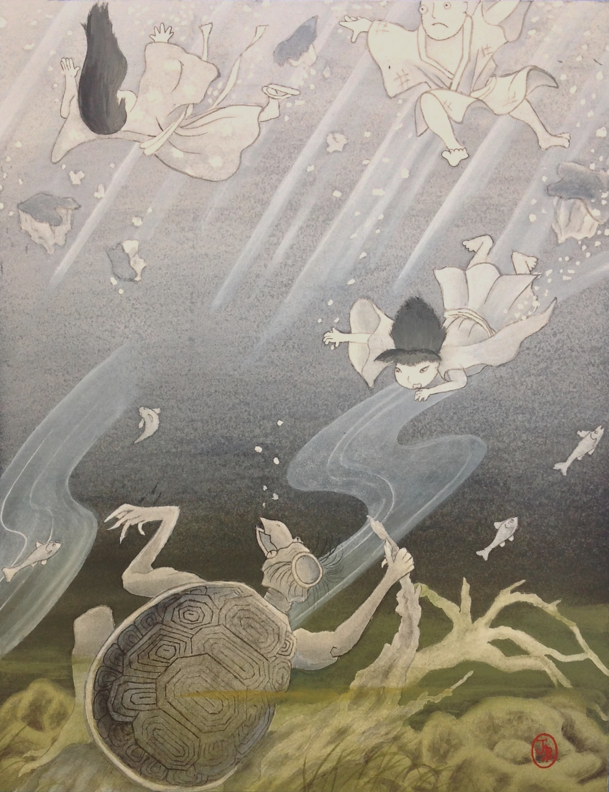
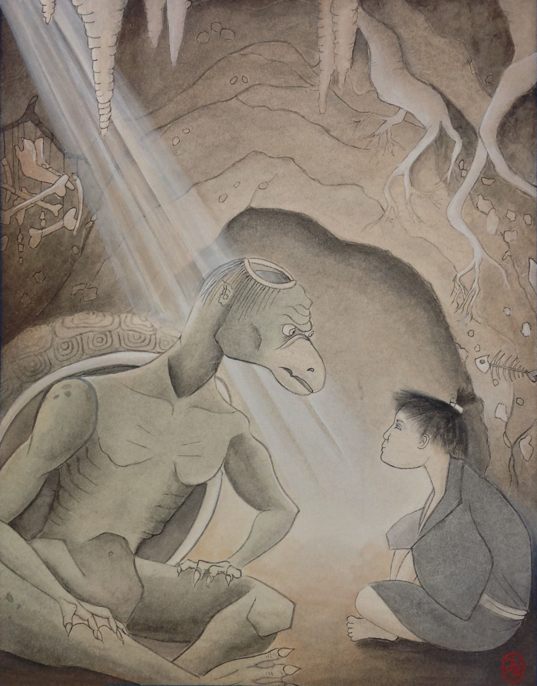

The summer sun's rays spilled through the forest's thick canopy, splintering into a thousand beads of light over the Tsurumi River. It flowed gently, as it always had, winding its way through the forest on the long journey from the mountains to the northwest until it finally emptied into the sea.

To the casual observer, nothing seemed out of place about the river. Nothing disturbed its gentle flow save one thing – silently breaking the water’s surface were two yellow eyes set high on a dark green, leathery head rimmed with coarse, brown hair. At the center of the brown hair was a large, bald indentation consisting of small grooves of bubbling water. The eyes surveyed the river, where they had resided for time immeasurable.

The river gave off a peaceful, babbling sound that soothed the _kappa_. Today, however, four small creatures – children, it had heard them called – were playing some manner of game on a large stone jutting out over the river. One of the creatures sat in the middle of the rock with its hands covering its eyes while the other three danced a circle around it, singing:

> _Kagome, Kagome, the bird in the cage,_ 
> _When, oh when, will you come out?_ 
> _In the evening of the dawn,_ 
> _Crane and Turtle slipped and fell._ 
> _Who's behind you can you tell?_

At this point, the singing children froze, and the child sitting in the center shouted in a high-pitched voice, "Kichibei!" The other children burst into laughter, replying in unison:

> _That's not right, that's not right._ 
> _Just like a dream._

After a moment the children began circling again, repeating the first verse while the child in the middle continued covering his eyes.

The river demon watched them curiously, playing above its river. It had to admit that it did not mind the tune, but why must the pitch of their voices be so high? They were certainly nothing like the quiet babble of the river water flowing over rocks and fallen trees, or the chirping of the cave crickets in its home, or even the songs of the swallows and larks–at least the birds kept their songs brief. The children's song hurt its ears, and they had been coming to the river for weeks. It knew it must rid itself of them, but until today it had never considered exactly how it could do so without drawing the attention of the larger ones.

It did not fear them; its powerful hands could break their bones with a single strike. The large ones had tricks, however, ways of hurting from afar, and hot magic they used, a frightful thing which made even water disappear into vapor.

The _kappa_ sunk below the water, its straw-like ring of mud-colored hair the last disappearing evidence of its presence. It chuckled silently at its own cleverness, sending bubbles floating up to the river’s surface. With this plan it would rid itself of the noisy creatures and, at the same time, solve another of its problems–its monotonous diet of fish and reeds. There was only one thing it enjoyed more than the tender flesh of children, but it had not found any of those floating in the river of late.

Swimming ten spans down, it passed a school of trout darting from its path. Once it reached the muddy riverbed, filmy moss brushed against its face and it swam along the bottom toward the bank where the children played.

Upon reaching the base of the large rock on which the children played, the _kappa_ set about the first step of its plan. Driving green, clawed hands deep into the oily muck, it began to dig away the earth supporting the massive rock. Dirt spread throughout the already murky water of the river, the current carrying it downstream. The _kappa_’s scaly hands lifted a rock, a crayfish darting out from beneath it and swimming beneath another. The river demon tossed the rock aside and continued its work weakening the base of the large stone while the children – oblivious of their peril – continued to play above.

~ * ~ *  ~

It was Yūsuke's turn to be _oni_ again and he wasn't happy. Kichibei must be cheating because every time Yūsuke ended up behind him, he shouted Yūsuke's name and Yūsuke had to be _oni_. He was certain that Kichibei was cheating. Kichibei was just trying to make him look dumb. Next time Kichibei called out Yūsuke's name he was going to get it.

Yūsuke cast Matsu and Yuki a sheepish look, but the two girls laughed, Matsu's eyes shining and Yuki's chubby cheeks glowing. He put on a sour face as he regarded Kichibei and plopped himself down in the middle of the big rock jutting out over the Tsurumi River. Pouting as he peered down into the dark water, he thought he spotted the shell of a large turtle moving far below the surface, but it disappeared beneath the rock. He covered his eyes, the memory of a giant turtle swimming beneath him faded as quickly as it had come, and heard only the sounds of the other children circling him, singing the tune of Kagome, Kagome.

~ * ~ *  ~

Kichibei could not help but laugh as he sang the song, circling around Yūsuke with the others. He had guessed correctly that Yūsuke was behind him for the third time in a row. Yūsuke must think he was cheating, but Kichibei had discovered a trick – whenever Yūsuke was behind him, Yūsuke's body blocked the sunlight shining on Kichibei's back. Matsu and Yuki were too small for their shadows to reach his back, so if it became cold, it was certain to be Yūsuke standing behind him. He and the girls finished the first part of the song, Kichibei chuckling at his own cleverness.

As he approached the side of the rock closest to the bank, though, he felt the surface of the stone shift under his feet. It rose up slowly at first, then began sliding down the bank into the river. As they realized the rock they were playing on was falling, the children tried in vain to jump toward the shore, instead tumbling into the water. Yūsuke was the first in, followed by Matsu and Yuki, then Kichibei.

The murky river water swallowed Kichibei, but he was a good swimmer and found the surface quickly. Gasping for air, he looked around for his friends. A few feet away, by a fallen tree half-immersed in the river, Matsu popped up. Shortly thereafter, Yuki's round face appeared not far from Matsu. Yūsuke was nowhere to be seen.

Kichibei prepared to submerge and look for Yūsuke, but Matsu and Yuki both disappeared under the water with startled cries. Kichibei dove underwater to search for them, his eyes greeted with a horror his young mind was not prepared for.

Through the murky water, down among the reeds, Kichibei saw a giant turtle, with four unusually long limbs, each ending in long, webbed fingers or toes. Under one arm, the creature held an unconscious Yūsuke and under the other, it had both Matsu and Yuki. From a beaked face, its two, yellow eyes regarded Kichibei for a moment, as if pondering whether it could carry him as well. The creature seemed to decide it carried too much already, turning and swimming away.

Kichibei took one final breath before diving deep into the river and swimming after the _kappa_, for he recognized what it was. He knew also that if he did nothing, his friends would never return home. The only food that a _kappa_ enjoyed more than children was, of course, cucumbers.

Kichibei swam desperately after the river demon, his arms and legs burning as he strained to keep up. Into the reeds he swam, circling around large, jagged stones as he followed the green creature's bulbous shell. The only reason he was not left behind immediately was because it's cargo of children burdened the river demon. Still, it propelled itself through the water using only its legs and Kichibei struggled to keep up.

Passing through a school of _iwana_ – their long, sleek bodies darting in all directions – Kichibei felt his lungs strain for air. Panic gripped him as the _kappa_ swam behind a mossy rock on the river floor and he lost sight of it. He swam around the stone and found himself facing a dark hole in the riverbed; like most children, the dark frightened Kichibei. Remembering his friends' peril, however, Kichibei mustered his courage and dove blindly into the opening. After swimming a few seconds in absolute darkness, Kichibei was sure he had lost the _kappa_ and was going to drown, until a light shone down through the river water. He swam upward toward the light as if it were a beacon of hope, and found himself breaking the water's surface.

Though light shone through multiple holes in the ceiling, it was still dim enough that Kichibei's eyes took a moment to adjust. The smell of mud and musty air filled his nose and he heard the faint chirp of cave crickets. Once his eyes had adjusted, Kichibei realized he must be in the _kappa_'s lair.

The cave was wild, but had a rustic feel, like a place that was lived in. To the left was what appeared to be a tiny kitchen with a stone counter complete with crude utensils. To the right was a dinner table built from wood and stones. Just behind the table was a rope ladder that climbed up and out of one of the holes in the ceiling. The earthen walls were decorated with artwork made from bones – fish bones, Kichibei told himself. Treading water as quietly as possible, he caught his breath and calmed his racing heart.

Kichibei searched the cave for the _kappa_ and found it easily. The fearsome creature placed the three unconscious children onto the stone table before stretching its arms wearily and sitting down cross-legged on a bed of straw. Those powerful arms were a mossy green and longer than Kichibei's entire body. He had heard that _kappa_ were stronger than humans and could throw a _sumō_ wrestler with one _jūdō_ move or split a man's skull with one blow. Sneaking past it was out of the question, not if he wanted to save his friends too.

As luck would have it, though, Kichibei was not wholly unprepared. A few days earlier, a group of strangers had passed through his village and stayed at his family's inn. One of them, an older man, had been full of stories, including a story about _kappa_. Kichibei had sat mesmerized by the fire, drinking in the stories like _amazake_. He watched the creature now, trying to understand if the things in the story he heard were true. From the river pool, he could barely make out a large, bowl-shaped indentation on top of the _kappa_'s head, which bubbled full of water. After a moment studying the small cave, Kichibei crept out of the pool, a plan already in mind.

The creature spoke to itself, unaware that it had company. "Who should I eat first?" It twirled its stringy, brown hair in one clawed finger as it watched the sleeping children. "The big one is too big. I'm not very hungry yet." It pointed a long finger at Matsu. "Maybe the little one?" Thankfully, the creature appeared to give up on eating at all, and instead turned to begin playing a game of _shōgi_ by itself. The pieces for the board looked to have been carved crudely from driftwood.

"E-excuse me, sir?" Kichibei spoke. His bare toes sank into the wet sand of the cave floor as he warily approached the creature. In its surprise, the _kappa_ jumped up from its seat so forcefully that the shōgi board ricocheted off the wall across the cave. It faced him in a _jūdō_ stance, its yellow eyes widening as it recognized Kichibei.

"You! I should have put you to sleep like the others!" Its eyes narrowed suspiciously. "What are you doing in my home?" The _kappa_ thumped its shell, pumping out its chest as it approached him.

Kichibei, who was doing all he could to not shake in terror, forced a smile on his face and stuttered as he bowed. "F-forgive my intrusion, s-sir. My name is K-Kichibei." Be polite. That was what the old man who told the story had said. _Kappa_ were particular about manners. Still shaking, Kichibei looked up in time to see the creature blinking at him, surprised. It started to bow in response, but as the water on its head began to spill out, it straightened, a suspicious look on its beaked face.

"I am Daikichi, little Kichibei, and I am not as foolish as you might think." Its voice slurred as it spoke, like the sound of pebbles sloshing around in a bucket of water. The creature walked over to a stone counter in its tiny kitchen and grabbed a wooden ladle from a pot. Dipping the utensil into the pool Kichibei had emerged from, it dribbled water over its bald head, filling the indentation again. It placed the ladle onto the counter and turned back to Kichibei.

"I can't let you leave now, you see? I'll just need to eat you too." It opened and closed its beak with a wet, smacking sound. "That's all there is to it. It's not personal." It started toward him, its long, mottled arms reaching.

"I ch-challenge you to a c-contest!" Kichibei blurted out, stopping the creature's clawed hands in midair. Kichibei bowed again, and the creature – clearly annoyed now – bowed more slightly this time, the yellow eyes never leaving him.

The river demon continued forward, looming above him. Kichibei, who was shaking despite all efforts, could smell it, as if everything wild and uncontrollable about the river was wafting over him at once. Its beaked face was so close that Kichibei was forced to shut his eyes to stop himself from fleeing. He could still feel the river demon's breath, though, cold with the odor of fish and moss. He fought the urge to recoil from the creature as it spoke.

"A contest? What is the contest and what are the stakes?"

"A t-test of endurance! If y-you win, I'll b-bring you more children to eat...and c-cucumbers." Its eyes perked up at that last addition. "If I w-win, you will let me and my friends g-go." Kichibei pointed to his three friends who were asleep on the table. A snort was the _kappa_’s only reply. "I will explain the rules," Kichibei continued, "...if y-you accept." From the way the creature's chest puffed out and its chin raised in indignation, he knew what the old man had told him was correct–_kappa_ were proud creatures and would not refuse a challenge on the basis of honor.

The creature laughed now, its cackle wheezing wetly out of it, as if a gourd half-filled with water were being squeezed. "I have never refused a contest. You will see what a master of endurance Daikichi is!" It finished boasting by squatting in front of Kichibei with its knobby arms on its knees, staring straight at him with its beaked mouth formed into a strange half-smile.

"Then you accept?" Kichibei looked at it, a bit of his confidence returning.

"Of course! Let's get on with it then." It stood up again, easily twice as tall as Kichibei, and turned its massive, mottled-brown shell to him. It walked back towards the center of the cave, then turned to face him again. "What are the rules?"

Kichibei smiled, exhaling with relief as he wiped his sweaty hands on the front of his dripping clothes. His nerves had calmed a bit, enough that he could almost speak normally. "The contest will be to see who can sit on the cave floor for the longest without moving. The first one who moves more than his eyes loses. You sit...," he paused, glancing around the cave, then motioned to a spot that seemed like any other. "There." He seemed to consider again, cupping his chin in his hand as he had seen adults do, as if he were thinking carefully, then nodded. "And I will sit directly in front of you so we can see each other."

The creature furrowed its eyes and cocked its head in bafflement. "A sitting endurance contest?" Sighing, it clapped its clawed hands together, the sound echoing through the cave. "Well, let's get on with it." It sat down cross-legged on the spot Kichibei had indicated and looked over at him, its voice friendly this time. "After I win, I'm glad I won't have to eat you," it said. "You are a strange one."

Kichibei glanced over to his friends on the table as he took his spot in front of the creature. "What did you do to make them like that?"

"Oh, that?" It smiled again in its odd manner. "An old pressure point here, on the left side of the neck. It will put anyone to sleep for as long as you want." Daikichi indicated a spot on the side of its neck.

"That's amazing," Kichibei said, looking genuinely impressed. "And how will you wake them again?"

"I won't. It's easier to eat them like that." The creature picked at one of its teeth with a claw, as if it were saying that dirt became mud when it was wet.

"Ah, so it isn't possible. I guess that's what I expected." Kichibei let a look of disappointment spread across his face.

"Of course it’s possible!" It clicked its tongue in frustration. "You just press the same spot on the other side of their neck to wake them." Again, it spoke as if it were explaining something obvious.

Seriousness returned to its face. "Don't think for once that you can win. We _kappa_ have been known to sit for days meditating. And when it comes to contests, we absolutely never lose."

"I'll do my best," was all that Kichibei said as he sat in front of the river demon, watching it. Finally, he asked, "Are you ready?"

"Yes." It slurred, staring at him with those yellow eyes, a vision of calm and stillness now. The two locked eyes, and Kichibei became very uncomfortable under the force of the _kappa_'s gaze. It seemed to be staring into his mind, knowing everything he knew. The contest had begun.

As Kichibei and Daikichi stared at each other, time began to pass with agonizing slowness. Minutes turned to an hour and the heat of noontime summer began to sink down into the cool cave. Sweat began to bead on the _kappa_'s brow, and Kichibei felt drops sliding down his own face. The streams of sweat tickled his skin as they ran down his cheeks and neck, but he endured them. The slightest movement meant he would never play with his friends again, never hear Matsu and Yuki’s laughs or Yūsuke’s grumbles. The sunlight that had come down through the ceiling of the cave before began to move across the cave floor, creeping towards them, and Kichibei found himself begging it to hurry. After what felt like an eternity, they both sat directly in the sun's rays.

It was then that the _kappa_ began to look ill. Before, its green skin, speckled with brown, had been dark green and full of moisture. Now, though, under the sun's rays, its skin took on a pallid, grey hue as it slowly dried up. Its breathing, formerly slow and steady, became labored and wheezy. From the story the old man had told, Kichibei knew the source of a _kappa_'s power, and that small pool of water on its head was slowly drying up in the sun's hot rays.

The sweat poured down Kichibei's face, but what he saw filled him with renewed strength. As Kichibei watched the river demon's eyes, he saw anger in them; it knew it had fallen into his trap and was thinking of a way out. The furious eyes, still fixed on him, began to droop, and a tight, rasping sigh issued from its mouth, telling him that it was rapidly losing its strength.

Finally, with the indentation on top of its head almost entirely dry, the _kappa_ fell over onto its side, gasping for air. The vitality it had once possessed was gone. It reached feebly for the wooden ladle it had used earlier. Up on the counter, though, it was impossible to reach.

Kichibei sighed and stood up, knowing he had won. Running over to the table where his friends slept quietly, he pressed the side of each of their necks, just as the _kappa_ had taught him. One by one they awoke, giving him confused and groggy looks. Kichibei pushed them each toward the rope ladder he had seen before, up and out of the cave.

Kichibei watched each of his friends make their way up the rope and to safety before he glanced back at the _kappa_. Daikichi spoke to him, pleading. "W...water...," it rasped. "H...help me?" He watched it, lying on its side with its head turned up. The yellow eyes, so frightening before, stared at him sadly.

"You shouldn't eat children," Kichibei scolded it as he picked up the ladle and dipped it into the pool of river water. Kneeling beside the _kappa_, he dribbled the water carefully onto its bald spot, moistening it once again. The _kappa_ heaved a heavy sigh, sitting up as it regained a little strength. Kichibei took two more trips back to the pool, each time dribbling more water onto Daikichi's head, until the pool was filled and bubbling again. He handed the river demon the ladle and backed away cautiously as it cast its odd smile his way.

"You tricked me," it accused him. "You tricked me and denied me my meal. Perhaps I should eat you instead?" Kichibei’s eyes went wide and he backed away, eyeing the rope ladder. "No, perhaps not. After all, you did win the contest." It motioned with the ladle toward the ladder leading up and out of its lair. "Go," it said, and Kichibei needed no further urging.

As he climbed up the rope ladder, the _kappa_ spoke to him. "You are clever, Kichibei," it said, its voice once again the sound of the river, strong and wild. "And you saved my life, even though I was going to eat your friends." The boy stopped climbing and looked back at Daikichi. The _kappa_ stared at him with those yellow eyes, as if seeing him for the first time. "I will not forget you."

Kichibei smiled back at Daikichi, no longer afraid. "Next time we'll have an eating contest. I'll bring cucumbers!"

Daikichi laughed, the smile strange on its beaked face. “Now that is a contest I will not lose!”

Knowing the truth in the _kappa_’s words, Kichibei laughed, climbing the rest of the way up the ladder and hurrying after his friends.
