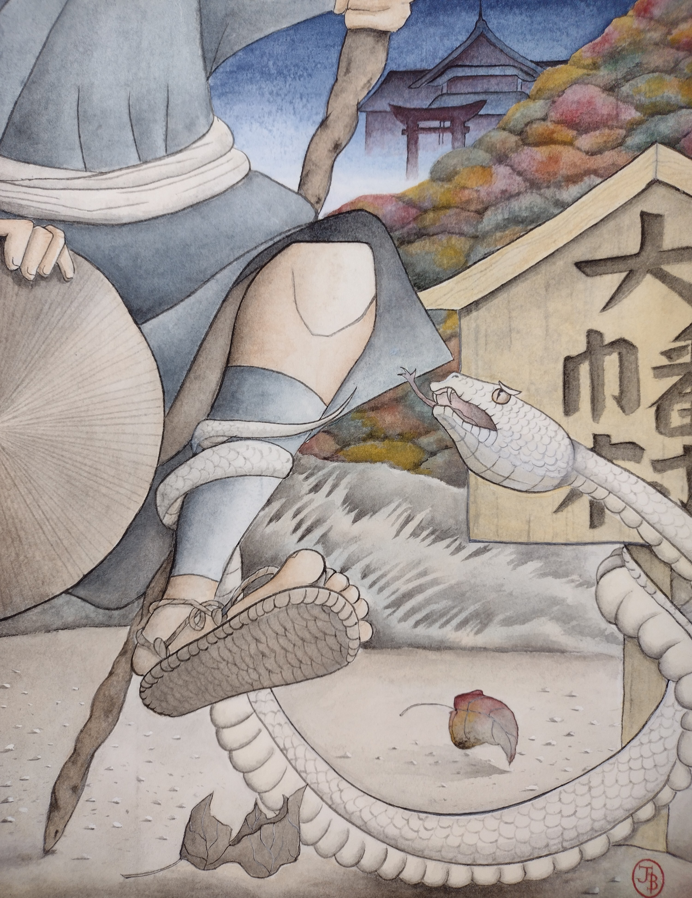

"We're going, and that’s final!" Yoshi slammed his wooden _sake_ cup on the table. Behind him, he could sense Ururu slithering to her usual place in the corner under the straw where she sulked whenever he breached the topic.

"Stupid Yoshi," Ururu grumbled just loud enough for him to hear between chomps of the dry meadow grasses. "Why can't he just let sleeping dragons lie?" Despite his drunkenness, Yoshi bit his tongue, resisting the urge to tell Ururu for the hundredth time that she couldn't possibly be a dragon. In all the years he had known her, and she had grown neither legs nor wings!

Yoshi had made this threat twice already, only to buckle under Ururu's persistent fits. This time was going to be different, though. This time he would make the journey up Mount Fukuō and visit the shrine there.

"You're terrible at painting, Yoshi," Ururu said, at his shoulder now. "That cross-eyed painter will never take you as his apprentice. Just give up and relax here with me in the straw and accept the way things are." If a serpent could grin, Ururu almost certainly was as she moved back to the straw and began once again to munch on it.

"I wouldn't need to be the painter’s apprentice if you hadn't broken the potter's family heirlooms." Yoshi cast an angry look at Ururu, who didn't appear to notice or care.

"You can hardly blame me. Who displays their most valuable pottery on delicious, carved pine?"

"The potter's wooden pedestals were not food! You don’t eat people's things!" Exasperated, Yoshi flung his hands in the air, spraying ink from his brush across the table and his painting. Ururu was right. He truly was no good at painting and that fact only fanned his anger.

"You know, I wouldn't eat things if you gave me proper respect. Kami have needs too."

Yoshi laughed. "Who in the world would respect a snake who eats or breaks anything she can sink her teeth into?" Yoshi laughed. He knew how much Ururu hated to be called a snake, but he no longer cared. "Tomorrow we are going to Ryōsanji Shrine. End of discussion."

Only a momentary pause after Yoshi spoke betrayed Ururu's nonchalant tone. "Ryōsanji? Why would you ever want to go there? That's all the way up a mountain."

"You know why," he replied, looking sternly at his infuriating, serpent-bodied companion. Ururu had draped a puffy ball – one of two that fastened his best haori shut - over the corner of a low, cedar table, batting it back and forth absently with the tip of her tail. The sight of her playing with his best clothing, along with the sake, loosened his tongue.

"First, there was the weaver, whose inventory of undergarments you ate a line straight through. Why underwear? I have no clue! Then there was the potter, of course! And, as if you had not gotten enough wood, next you ate through three cabinets at the woodworker's shop. None of them could see you, of course, so who else could they blame?" That question led him to the obvious next one he asked whenever his troublesome companion frustrated him enough.

"Tell me, Ururu. Why can't people see you?"

"Like I care if humans can see me."

"No one has seen you, Ururu! Not even Old Senzan and he was a priest!"

"Stupid Yoshi should know that not all priests can see kami. And Old Senzan was blind as a bat anyway! I don't think he even saw you!" Ururu swatted the fluffy ball and it flipped around the corner of the table. As an afterthought, she added, "He smelled bad, too."

"Old Senzan is a decent man! Don't say bad things about him," Yoshi chided.

"I'm telling you, he doesn't smell right. Never trust a priest with less hair than you."

Brushing aside the fact that Ururu had no hair, Yoshi pressed on. "Do you know what I think, Ururu?" Yoshi set his brush down on its rest, pausing for a moment to wipe the ink off the wooden table that–miraculously–Ururu had never chewed to pieces. "I think the reason no one can see you is that you don't really exist." Yoshi gave his companion of the past twelve years a flat look. Ururu wriggled up onto the table and glared at Yoshi defiantly.

"I exist, Stupid Yoshi," the serpent hissed, her forked tongue flicking out and almost striking his face. "You would know that if you ever left this tiny village. Not that you ever will, Scaredy Yoshi."

"That's exactly what I’m doing tomorrow morning! And because you can’t bear to be far from me, I’m sure you'll be coming too." Just talking about leaving the vicinity of the village made Yoshi nauseous, but he wasn't about to give Ururu the satisfaction of knowing that.

"I'm most certainly not going," Ururu retorted, chortling as she slithered back to the pile of straw. "You'll be all alone in the scary world, Scaredy Yoshi."

Hoping to mask his rising anxiety, Yoshi harnessed his anger to throw himself into preparations for tomorrow’s journey. Though the journey up Mount Fukuō was only a day and a half in the worst weather, he packed a week's worth of dried fruits, vegetables, and mushrooms, adding a small clay pot and two bags of millet. One could never have enough food when venturing out into the wild, not that Yoshi knew anything about that. Ururu was right that he always kept to the safety of the village.

As Yoshi packed his bags into the late hours of the night, he could feel Ururu's eyes burning tiny holes in his back.

---

The next morning, an irritating voice invaded Yoshi’s sleeping world.

"Yoshi! Wake up! Let's go play in the river!"

He was still half-asleep. Ururu had wrapped herself around his ankle and proceeded to drag him out from under his blanket and into the chill, late autumn morning. Tired, Yoshi attempted to roll over and pull his futon back over himself.

"Yoshi! Wake up and take me to the river! This is when the worms and crayfish are out! I'm so hungry!" With that last plea, Ururu shook Yoshi's leg furiously to and fro.

"Let me go!" Yoshi exclaimed, yanking his leg back. Ururu, who was latched onto the leg of the nearby table, pulled hard in the opposite direction, letting out an "Oof!" as her serpentine body was stretched in the process. Yoshi slid back out from beneath his futon, pulling a blanket along with him. "Let go!" Yoshi moaned. He shook his leg violently this time, trying to escape Ururu's grasp. It worked as Ururu let go and headed straight for the straw pile in the corner. Yoshi stood, hair strewn about and still half asleep, casting a bewildered look around the interior of his small hut.

The table Ururu had latched onto now stood in the middle of the small room, at an angle from the morning struggle. The room itself was recessed with a set of low stairs leading up to a doorway set on an incline to keep the heavy rains out during the monsoon season. A small fire pit stood at the other side of the crooked table, which had–by stroke of luck–narrowly avoided failing into the pit. Yoshi kept the fire extinguished whenever he was not cooking, and scorch marks on the table’s legs told of mornings not so fortunate. Far above, the thatch roof formed a vaulted ceiling that protected from the occasional heavy snows in northern Ikawa Province. His life and this small hut were the two things of value his deceased parents had left him.

"River?" Ururu said from her straw pile in the corner, looking up at Yoshi with a disarming smile. She was curled up in concentric circles and stroked her chin absently with her tail.

Yoshi rubbed his head–which had begun to clear–and walked to the doorway, lifting the wooden slat that kept the door shut. Pushing open the door, he peeked out into the early twilight. Though hints of day were on the horizon, the sun would not rise for another hour.

"We're not going to the river today. You know where we're going."

Now that it was clear Yoshi had not forgotten yesterday’s argument, Ururu abandoned all pretense of civility.

"Stupid Yoshi! Stupid Yoshi!" she repeated again and again, shooting out of her bed with such fury that straw flew about the hut. Speeding about the room, Ururu upended a row of pots here and knocked over his unfinished painting there. Knowing her temper well, Yoshi had been forced to sell anything of value, and what he could not sell he either hid or kept out of her reach. The small altar to his ancestors was the only part of the room that seemed to be safe from Ururu's caprice. After a relatively brief tantrum, she spoke again.

"Stupid Scaredy-Yoshi can go to the shrine all by himself! Ururu is going to the river!" With that she disappeared through a hole in the wall near her straw bed that winked into existence only as she came and went.

Alone now, Yoshi sighed with relief. It was short-lived, however, for without Ururu there to distract him with her antics, thoughts of the coming journey crept in like a dark cloud. Years of battling his mind had taught Yoshi that throwing himself into action before the anxiety could fully set in was the only way to function. The more he thought about his plans, the less likely he was to actually follow through with them.

This time he was not going to lose to Ururu. She was always well-behaved once he gave in, but slowly she would slip back into her troublesome ways, eating furniture and generally being a nuisance. her mischief had cost Yoshi more opportunities than could be counted on a single hand, and that was the real problem. He couldn't keep living this way, always at the constant mercy of Ururu's tantrums, when he couldn't even be sure she existed. It was possible she was real, but Yoshi was certain. He had to make this trip, if only for his sanity.

It’s easier without Ururu anyway, Yoshi thought. Hastily assembling his supplies, he prepared to leave. By the time he had donned his overcoat, put on a wide-brimmed straw hat, and collected his pack, however, Ururu had still not returned. Deciding he was beyond caring, Yoshi slipped on his straw sandals, opened the door, and paused as he looked out into the chill morning. Perhaps he should have breakfast before leaving?

As he turned back to start a fire, though, he stopped himself, remembering that last time this was as far as he had gotten. After making breakfast he had completely lost the energy to leave and ended up spending the day in bed. Without risking further hesitation, Yoshi plunged out into the chill air. This time he would make the journey.

Once outside his hut and onto the road leading to the village, the worries subsided. Though it was still dark outside, the sun had begun to rise in the east, and colors sprayed across the sky like dancing birds promising clear weather. Just the kind of weather one hoped for when setting out on a journey. He would have to stay one night at the shrine, maybe longer if he needed help. Yoshi checked that he had brought his coin string to pay the priests.

Upon reaching the road to the village, Yoshi turned left and passed a sign post indicating directions to travelers. As he did so, however, he heard a soft thump behind him and the familiar feeling of something wrapping around his ankle. Looking down he was not surprised to see Ururu, tail encircling his leg and head wrapped around the signpost, glaring back at him with a stubborn look in her eye. And here Yoshi had thought the day was off to a splendid start.

"Stupid Yoshi can't go that way, remember? The people told you not to come back."

"They said not to come back to the village unless I was buying something or passing through. Since I won't be staying, there shouldn't be a problem." Yoshi pulled hard on his leg, forcing a yelp out of Ururu. She tightened her grip on his leg.

"Stupid Yoshi! Stop fighting and let’s go to the river. It’s much more fun than some mountain with strange, smelly people."

Yoshi loosened the tension on his leg, as if he were giving in, but instead yanked hard in the opposite direction. Ururu stretched a bit before she released the post, causing the two to stumble forward and tripping Yoshi as she became tangled between his legs. The two fell to the dusty ground together.

"Oof!" They both exclaimed in unison, glaring at each other, both equally annoyed at the other’s mirror reaction. Yoshi stood and rubbed his rear while Ururu snaked along his chest, around his waist, then down his leg.

"If you're not going to help, at least don't get in the way."

"Suit yourself, Stupid Yoshi. Ururu will go find someone else more fun to play with." She slithered off into some bushes and was gone.

Yoshi let out an exasperated sigh and dusted off his traveling clothes. Bending over, he picked up his fallen pack and walking staff and resumed his trek toward the village. He was only slightly anxious at being alone on the road before sunrise. Thankfully, though, he saw the first rays of daylight peeking over the horizon as when he reached the edge of the village.

Ōhata Village wasn't large, more of a cluster of twenty or thirty huts. The majority of the villagers were farmers, growing rice, millet, and other grains from the relatively hardy soil. The remaining families were artisans–a carpenter, a thatcher, a tool-maker–with the exception of a merchant, whose home often served as the village's gathering place. A family of samurai, the Imai, lived up on a hill and were vassals to a local lord whose name Yoshi admittedly did not know. They trained a small militia of about twenty men, and in return for protection they collected taxes. Yoshi estimated he had worked as an apprentice for over half of the artisans in town before they’d driven him out. It had only been the good standing of his parents that had saved him from complete exile.

Despite all the mischief Ururu had caused, the people of Ōhata had found enough pity in their hearts to allow Yoshi to visit occasionally and trade the herbs he grew and game he caught outside. If the fear of leaving Ōhata completely had not outweighed the fear of living in his semi-exiled life forever, he would have left long ago. All things in Yoshi’s life were decided by degrees of anxiety. Looking into the quiet, early morning village, Yoshi took a deep breath and entered, what felt like a fog of worry following him in.

The thatcher had woken up already and stood outside his hut, thrashing reeds quietly. Though Yoshi avoided looking at him–simply bowing awkwardly as he shuffled past–he could feel the man's eyes.

Yoshi pushed on further into town, reaching the center–a crossroads–and turning right along Sanrō Road, which led to Nishino Pass, the only way up Mount Fukuō. A small dog, Shiro, wagged its tail as Yoshi passed one of the farmers' huts, but he didn't slow to pet it. Normally he would have stopped, but he knew that stopping would only feed the ever-present worry in the back of his head that whispered, "Go back to bed. Be safe." Now that he had broken his inertia, Yoshi couldn't afford to let his guard down. He would rush through the town before anyone saw him and gave him a reason to call off the trip.

By the time Yoshi rounded the butcher's hut and the sun began to peek over the horizon, he knew he had overcome the first obstacle on his journey. The hut stood at the east end of the village, and Yoshi pressed on. The road ahead led gently up the slopes of Mount Fukuō.

To Yoshi's left as he set upon the mountain path was a quiet stream of water flowing softly down the mountainside, its direction changing each time it encountered a new cluster of moss-covered boulders. Along the sides of the stream grew the occasional pine tree, leaping out of the moss-covered rocks in some grand display of life’s tenacity. The stream would flow down the mountain and turn north at the village, joining at least two other rivers to feed Lake Koto, north of the village. What fish the villagers ate–mostly trout and bass–came from that lake. Far above Yoshi, two wrens darted about before disappearing in the pines further up the path.

Breathing in the cool, fresh air, Yoshi wondered at the natural beauty surrounding him. It certainly wasn't anything in nature that triggered his anxiety. Except for bears; they did make him anxious. The thought prompted Yoshi to reach beneath the folds of his traveling clothes and jingle a small bell, said to ward off bears. It couldn’t hurt.

As the day progressed, Yoshi noticed the pine trees thickening and nature sprang to life around him. He enjoyed hopping from one moss-covered stone to the next, the rough straw of his sandals providing excellent traction. The warmth of the autumn sun floated down from the pines above, and Yoshi soon forgot about his worries, the cloud over his mind beginning to lift.

It wasn’t until Yoshi felt his stomach growl that he decided to stop for a meal and found an unpleasant surprise. Reaching inside his back, which admittedly felt lighter than it had at the start of his journey, Yoshi produced an empty bag that should have been heaping with millet. Upon further inspection, he saw the corner of the bag had been chewed through.

Frantically, Yoshi tossed aside the bag and checked for his other millet bag, finding it similarly empty, a gaping hole in its side as well. As he felt around inside his pack for the lost millet, his fingers found a hole in the bottom.

"Curse you, Ururu!" That damned snake had been in his pack just as he'd entered town! She must have chewed holes in his millet pouch while she was in there. What a spiteful creature! He could almost see Ururu hiding off somewhere, giggling at the trouble she had caused.

Inspecting his pack again, Yoshi found his agate and small steel striker for lighting fires had thankfully not been lost. Only a handful of millet pearls were left and he took out his sewing kit to mend one bag, shepherding the last of his millet preciously into it. He only had enough for half a meal!

Slowly Yoshi felt the fog of anxiety grow, a heavy blanket falling over his mind, and he considered again whether to head back home. From here, he wouldn't arrive at the shrine at the top of the Mountain until after sunset. Now that his food supply was low, it would be safest to return home.

But a voice inside Yoshi–a stubborn one he had not known was there–refused to be defeated. If he returned home now, Ururu would one again win and nothing would change. Yoshi was tired of living at the whims of a creature only he could see, scraping together barely a shadow of the life he was meant to have. Whatever that life was, he knew it couldn't be this.

"Not this time, Ururu. This time I’m going to Ryōsanji." Putting all his belongings back into his pouch and ignoring the growl of disagreement from his belly, Yoshi plodded onward up the gentle mountainside. "One foot in front of the other. That is how journeys come to an end."

The anxiety of not having food along with the knowledge that noon had already passed lent speed to his feet, propelling Yoshi up the mountain. As he forged ahead, he became so engrossed in the sound of his straw sandals and walking stick on the mountain path that he did not notice as he rounded a large boulder and came face to face with three unkempt strangers, stepping out from the thick pines in front of him. A shout from one of them roused Yoshi from his thoughts.

"Drop all your valuables!"

The men blocking his path were dirty and armed, clearly robbers set up to waylay travelers along the path to Ryōsanji Shrine. The man who shouted had an overgrowth of poorly trimmed facial hair and so few teeth that he had poor enunciation. Before the man could shake his rusty sword menacingly, though, Yoshi was already bolting away in the opposite direction, back down the mountainside. As he disappeared around the corner, he heard the men give chase.

Bounding down the mountainside faster than he imagined possible, Yoshi cut to the left quickly and dove into a thick outgrowth of pines, the needles scraping him as he burrowed deeper into the evergreen cover. He prayed that they would shelter him from the thieves. Of all the things to happen! Waylaid by bandits! I should have never left home!

As Yoshi wriggled his way deeper into the cover of the evergreens, he turned and peered out toward the mountain path just in time to see his straw hat lying on the ground, partially out on the path. As he reached a hand out hurriedly to retrieve it, his hat disappeared and he heard one of the bandits shout.

"I got ‘is hat! He’s hidin’ in the trees!"

Yoshi remembered he had his walking staff, a heavy stick of sturdy ash, but fear paralyzed him. He watched as one of the bandits stood over him, silhouetted against the midday sun. Just as Yoshi was certain the man would reach out and push aside the branches and reveal him hiding, he heard one of the other bandits further away shout in a triumphant voice, "Tree’s shakin’ here! He’s gone this way!" The bandit near Yoshi turned and hurried off toward where the other bandit had shouted. Yoshi lay still on the ground beneath the cover of pine trees, shaking with fear and too afraid to even breathe a sigh of relief.

After what felt like an eternity, Yoshi found he could move again. Carefully–silently–he wriggled out from his hiding place in the pine trees and back onto the path. His hat lay strewn on the opposite side of the path, half-floating in the stream. Yoshi considered leaving his hat where the bandits had dropped it, in case they returned, but he decided they hadn’t seemed intelligent enough to remember the hat and likely wouldn’t realize it had disappeared.

Still looking around for signs of the bandits, Yoshi crept toward the pine trees on the opposite side of the path, his curiosity piquing despite the fear of the bandits returning. Something had shaken the pine trees over here, just as the bandits were about to discover him. He quietly pushed his way through the thicket, not sure what he was searching for when he found a tree with scars at its base, scars from fang-like teeth that were all too familiar.

"Ururu!" Yoshi whispered as loud as he dared. "Are you there?"

Silence answered him. He was sure she had been there and she usually appeared when he called. She was certainly still upset with him, but that had not stopped her from helping him escape from the bandits. Or had they really existed? Did he hallucinate the bandits to convince himself to give up his journey? When was the last time Yoshi had heard of bandits on Mount Fukuō? They had seemed real enough, though, and their weapons had seemed deadly enough.

Deciding it was best to assume the bandits were real and returning any moment, Yoshi hurried up the mountain path, keeping off the main path until he could be certain he was out of danger. Thankfully, his travel garb was also well-suited for moving about the overgrowth. Despite the pine branches brushing against him and every few steps taking him through a spider’s cobweb, he pressed on.

After about an hour or so, Yoshi stuck his head out of the heavy brush and checked the path. The sun was setting on the horizon, spreading shadows over the mountainside and making all of nature seem to stretch out as if preparing for a night’s sleep.

Yoshi stepped out onto the path and brushed himself off, praying that any spiders clinging to him would fall from their webs. The bear charm around his waist jingled, startling him, and he scanned the mountain path for any sign of the bandits. Deciding no bandits were within earshot, he tucked the bell charm into his belt to muffle its sound and continued up the mountain path. Ahead he saw a torii–a tall, wooden gate–the first of three on the way to Ryōsanji Shrine. The sight of the torii quickened Yoshi’s steps, his eagerness to reach safety overcoming his fear. Yoshi remembered that his mother had taught him the center of the path through a torii was for the kami, so he walked on the left side as he passed through it.

"You really are going this time."

Ururu’s voice came from behind him and Yoshi turned back toward the torii to see Ururu curled up there in the middle of the path.

"Yes, I am finally going to make it," Yoshi said triumphantly. "Why don’t you stop getting in my way and join me instead?"

Ururu just watched him for a moment, her tongue flicking as she considered something. After a moment she spoke.

"Do you remember the summer you found me, Yoshi? I had fallen into the river while out on a tree limb trying to snatch a cicada. I bit onto a tree growing from one of the stones in the river and was holding on. You waded out into the river, scooped me up, and fed me. I was weak then and desperate for something to eat."

"I remember, Ururu. If I had known how much trouble you would be, I might have left you there." Yoshi meant it as a joke, but when he saw the sad look on Ururu’s face, he immediately regretted it. Uncharacteristically, Ururu didn’t retort.

"Well, you weren’t supposed to see me. I was as surprised as you." Ururu watched him and for some reason Yoshi felt a bit uncomfortable under her gaze. Something was strange about her now. "When you saw me I realized that I didn’t have to be alone anymore. There was someone smarter than a bird who could see me and who was nice enough to help me out. I’m sorry I caused you so much trouble. I really am."

For some reason, there was a finality in how Ururu was talking to him, and that made Yoshi uncomfortable.

"It’s alright, Ururu. You’re not always a pain," Yoshi joked, smiling. "Just most of the time."

Ururu gave him her signature fanged grin, her version of a smile. "Thanks for being my friend, Yoshi. Take care of yourself. I’ll see you around." With that, she uncoiled herself and started off down the mountain toward the trees.

"Wait! Ururu!" Yoshi called, rushing down the mountainside and stopping just inside the torii. He stared out at Ururu. "Come with me. We can talk to the priest, stay the night, and go back home together. I’m sure they have something delicious in there to eat. Maybe even some crayfish."

Ururu turned back again towards him and flicked her tongue thoughtfully. "I can’t go inside, Yoshi. They kicked me out and I can never go back." She paused. If serpents could fidget, Ururu certainly was doing so. Before Yoshi could interject, though, she continued. "Besides, the head priest there stinks of incense. Yuck!" With a laugh she darted off into the bushes, disappearing before Yoshi could ask who kicked her out and why she could not go back.

Yoshi considered chasing after Ururu, but he squelched the thought. She was unpredictable and seldom forthright about her motives. His answers were up the mountain, of that he was certain. Returning to the path, Yoshi continued uphill toward the second torii just visible a few hundred feet off in the distance. His footsteps, the thump of his staff, and the occasional owl hoot were the only sounds that broke the twilight’s silence.

The moon had crept up into the sky and the sun’s last rays were fading by the time Yoshi passed through the second torii and could see the final one. Someone holding a lantern stood beneath the inverted arch of the final, largest torii, the lantern’s red glow a beacon in the night. Stomach growling and ready to end his day’s journey, Yoshi all but sprinted up the mountainside toward the final gate.

As he approached the torii breathing heavily, Yoshi’s bear charm had shaken loose and jingled with each bounding step. Beneath the gate stood a priest in white robes who held a staff with the lantern hanging from a hook high above his head. The priest wore an ornamental head-dress, which Yoshi assumed meant he was important. Behind the head priest, Yoshi saw a number of other priests. Most noticeable, though, was a large deer-like creature–translucent and glowing a myriad of magnificent colors–which stood in the path directly behind the head priest. Mouth agape in awe, Yoshi slowed his ascent and gripped his walking staff tightly.

"Yoshi-san, we have waited many months for your arrival," the head priest said. "It seems today is a fortuitous day!" The man’s voice held more than a little excitement. Behind him, the other priests whispered excitedly too. The man noted Yoshi staring at the giant creature behind him and spoke again.

"Ah, you can see Shakunanjō-sama? Of course you can see kami. That is very good! Today is indeed a wonderful day!" The man’s laughter–rich and full–tore Yoshi’s eyes away from the giant, glowing deer. The priest’s face had a warmth to it, and Yoshi immediately felt that this was a man whom he could trust. "Welcome to Ryōsanji Shrine. I am the head priest, Jugen. Please enter and warm yourself over a hot tea meal and a warm bath. Once you are comfortable, I shall answer all your questions about the shared destiny of you and Ururu-sama."

Mouth still open wide, Yoshi found his body moving of its own accord, taking him toward the being called Shakunanjō, the head priest, and the promise of a hot bath and hopefully more answers than questions.
