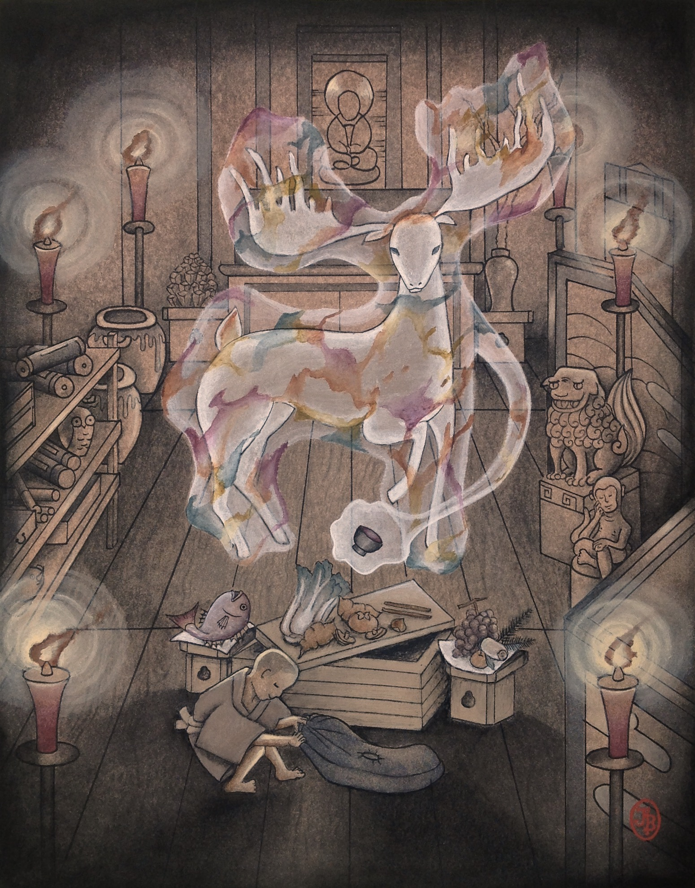

The early morning chill birthed a thick fog over Ryōsanji Shrine, the hills below rising through moist clouds like the undulating back of a serpent. The silence was broken only by the chirping of birds, the ever-present sound of a nearby waterfall, and the chanting of Shojumaru's father and two other priests as they stood before the Forbidden Hall.

Standing before a large, pine chest garbed in pure, white robes and chanting solemnly, Shoju's father and the other priests were an imposing sight. As Shoju watched them, a fourth priest opened the chest, revealing an assortment of fresh produce and fish, all offerings carefully selected from the lands surrounding the shrine. Apparently, Shakunanjō, the guardian _kami_ of Ryōsanji, deserved only the best for his morning meal.

The priests began to offer their blessings over the food, Shoju's father throwing salt left and right. Being only five, Shoju didn’t understand why his father was scattering salt everywhere but on the food. He was accustomed to his father doing strange things, but his mother often cautioned against wasting salt at meals. He resolved to scold his father later. For now, though, Shoju had but one goal in mind.

Once his father and the other two priests had lifted the chest and disappeared into the inner chamber of the Forbidden Hall enshrining their patron kami, Shoju stood up from crouching behind a large cedar and crawled under a fence of bamboo poles tied together with twine. As he emerged on the other side, Shoju stood again and crept along a path of flat stones that wound around the enshrining hall toward the rear.

The outside walls of the Forbidden Hall were made of smooth, fragrant wood that smelled nice to Shoju. There were no seams or windows along the side, but Shoju knew that in the rear there was a small vent large enough for a child to crawl through. As he rounded the corner behind the enshrining hall, bare feet padding quietly on the flat stepping stones, Shoju froze in his tracks.

Directly in front of him, a junior priest named Jōzen was sweeping fallen leaves and dust from the surface of the stepping stones. Shoju quietly backpedaled around the corner again and crouched there, peaking at Jōzen. His heart pounded in his ears. The junior priest, barely allowed to be sweeping the grounds around the enshrining hall himself, would never allow Shoju to be here. Shoju would be scolded and probably sent to do even more chores than he already had to do. He might even be forbidden to eat at dinner time.

Jōzen continued sweeping stones as he walked off in the opposite direction. As he did so, the man quietly hummed a tune familiar to Shoju, one performed at the upcoming autumn festival. As Jōzen hummed, he turned around once and re-swept a stone which had not been cleaned to his satisfaction, causing Shoju to duck hastily back behind the corner.

After a moment, Shoju peeked again and saw Jōzen's back, shambling away as he hummed. Shoju knew the man wasn't supposed to be humming. His mother had scolded him once for doing just that, saying it was bad manners and disrespectful to the kami. Shoju wondered why a junior priest like Jōzen didn’t even know that.

As the priest disappeared around the corner, Shoju rushed to the small opening at the bottom of the Forbidden Hall's rear wall and scrambled into it. Despite the hole being small, Shoju had ample room to wiggle around on his hands and knees and survey the inside. The opening in the wall led to a short tunnel that Shoju was able to crawl through, the ground beneath the enshrinement hall soiling his tan kimono. He remembered discovering this tunnel a few days ago as he’d watched a senior priest clean it with a long pole covered in peacock feathers.

As if summoned by his recollection, Shoju heard footsteps behind him and saw Jōzen's straw sandals only briefly before the man pushed the large, feathered pole into the tunnel. The feathered pole shoved past Shoju, though not roughly, and he hugged the side of the tunnel. He tried not to giggle as a hundred peacock feathers rubbed against his legs and face. Jōzen moved the pole around, giving the tunnel and Shoju a good cleaning. Just as Shoju thought he could not stand it anymore, Jōzen pulled out the feathered pole and walked away, humming as he went. Shoju itched his face and sneezed once from the dust before facing forward toward his goal.

Up ahead, he saw a flickering of dim candlelight tumble through a grating in the enshrinement hall's wooden floor and light up the earthen ground. Shoju scrambled forward in excitement, hoping to catch a glimpse of Shakunanjō through the slits in the wooden floor when the kami emerged to eat its breakfast. Once he reached the wooden slits, he peered up through them into the Forbidden Hall.

Through the large slits, Shoju could see his father and the other two priests waving pine scepters as they chanted, folded, white paper dangling from the ends. Small bells also attached to the scepters jingled as the priests shook them, and the sound excited Shoju. Surely the kami could hear that! The three priests knelt, opening the pine chest and making motions as if they were eating from the pine chest, and this seemed funny to Shoju. He had never seen his father pretend to do anything before. After a few moments, the men must have tired of pretending because they stood and shook their poles in unison while backing out of the hall, bowing all the way to the door. When they had gone from the hall, a heavy silence fell and only the flickering of candles and his own heartbeat – louder than usual – indicated to Shoju that time still passed.

A moment later, Shoju felt the same fuzzy feeling behind his ears and on his skin that he often felt when watching the enshrinement hall from afar, when his father and the priests were leaving. This time the feeling was stronger, and Shoju thought this must mean Shakunanjō was coming. He scanned around the Forbidden Hall for some sign of the kami, the back of his neck tingling.

The walls of the inner sanctum were lined with candles, each on its own metal plate. Artifacts such as scrolls, small carvings, and statues were displayed on altars. Shoju had no idea what was written on any of the scrolls, but he could barely make out images of animals painted on them. Other strange objects, such as a cedar tree branch and large pine cones were displayed along the walls as well. The room felt like a sparse forest populated by the creatures of the carved statues and painted scrolls. In the center of the room sat the pine offering chest. A larger chest made of dark wood sat elevated on an altar in the back of the chamber. Shoju watched the empty hall, bathed in flickering candlelight, from the safety of his hiding spot when something emerged from the dark chest.

Or, rather, something leapt from the chest, and Shoju gasped in surprise. The thing which emerged from the black chest resembled a deer of brilliant, swirling colors, however it was so large it almost filled the room. Its legs were each the width of a tree, and its antlers reached the vaulted ceiling high above. As Shoju watched, the massive deer slowly shrunk in size until it was the size of a normal deer, though still larger than any Shoju had seen before. He stared wide-eyed.

Why don’t you come up, Little One? The deer shook its antlered head as it circled the room, until it stood up on two legs like a person, its shape changing into something more person-like, but still quite deer-like. Its two front hooves shimmered with colors, transforming into something like the tentacles of the octopus his parents had made him taste once. The deer looked down through the wooden slits in the floor directly at Shoju, and he knew it could see him. For the first time, he felt afraid.

Do not be afraid. The voice sounded inside his head. You can see and hear me. That makes things easier. I shall make some room for you.

A glowing energy surrounded the creature that, for some reason, made Shoju remember the joy of playing in the woods with his brother, Takurō. The swirl of power floated down from the creature and interacted with the floor, the fibers of the wooden slats splintering apart and opening a hole large enough for Shoju to pass through. The energy receded from the opening and the kami stepped back, falling onto all four legs like a deer again. Deciding that Shakunanjō was not angry he’d snuck into the hall, Shoju stood up and pulled himself through the hole into the enshrining hall, laughing with wonder.

Many years ago, there were cushions in the cabinet over there, beneath my bones. The kami shook its antlered head again, seeming to indicate the direction of the large, blackwood chest. Beneath it, Shoju saw a small handle to which he ran over and seized, sliding open the door. He reached inside and grabbed a zabuton with both hands, pulling hard before it came free. Shoju tumbled backward and almost knocked into the white, pine chest the priests had brought inside. The zabuton brought with it a thin layer of dust that had gathered on its surface, causing Shoju to sneeze once more.

“A-are you Shakunanjō?” Shoju blurted out his question before tossing the zabuton on the ground. The kami did not answer for a moment and Shoju used the opportunity to get another zabuton, struggling to lift it again before tossing it down next to the other cushion and the pine chest. The colors inside the kami swirled about and Shoju somehow knew that meant it was pleased. The being settled upon one of the cushions.

Shakunanjō is the name the priests call me. The other kami call me Furiō. But a name is just a name, Little One. I am a deer, although I've become something else since your ancestors placed my bones here. I can talk now, and even change the weather. It was me, though, whom you came to see, yes? Shoju thought the deer of swirling colors smiled at him, and that made him feel reassured for some reason. You can call me Shaku if you want. And what are you called?

"I am Shojumaru. Pleased to meet you, Shaku-sama." He added the suffix as his mother had always instructed him when addressing kami and bowed respectfully to it. The large stag flashed an array of brilliant colors that Shoju could not name before returning to its former, more subdued swirl of golds, greens, and browns.

"Pleased to meet you too, Shojumaru. Shall we see what bounty the priests brought this morning? I hope there are apples or persimmons today! Nothing wakes up an old deer like morning fruit. I never much ate them while I was running about the forest, but I’ve grown to enjoy them.'' The deer, still resting on its zabuton, reached out from its body with tentacles of the same, luminous energy that had opened the slits earlier and the tentacles appeared to pass through the lid of the pine chest and dig around.

Ah, a red snapper, six plump berries, fresh rice...and a persimmon! Would you like to share some of this fine feast with me, Shoju?' The kami's tentacles of energy retracted back inside its body and it turned toward the boy.

Shoju's stomach growled, revealing that he had skipped breakfast to be here. "Sure!” was his enthusiastic answer.

Wonderful! The priests long ago used to eat with me, but I cannot remember the last time I shared a meal with anyone. Shakunanjo's tail shook, echoing its own excitement. Of course, you'll need to open the chest I guess, unless you know how to feed through your ki?

Shoju shook his head, unsure what the kami was talking about, but certain he hadn't been shown how to do anything like that. Standing, he walked over to the pine chest and pushed open the lid, revealing a variety of foods, including the items that Shaku had mentioned. “I’ll tell my father you like persimmons." Shoju smiled. "Why can't you open the chest like you did that wooden grate over there?"

Shaku's energy tentacles reached out again and lifted items from the offering chest–a cabbage, a sweet potato, a few shiitake, some assorted berries–and divided them between the two of them, setting the foods on the ground in front of Shoju and himself. The sweet potato Shaku broke in half among them. Shoju reached out and grabbed a berry, almost popping it into his mouth before his mother's phantom voice echoed in his memory, scolding him for not showing his gratitude for the food first. The boy set down his berry and placed his hands together, bowing to the kami before him.

Shaku watched Shoju, an amused look on its face. Your mother teaches you well, Shojumaru. We are part of a cycle, you and I. You offer respect and gratitude. I offer plentiful harvests, safety, and good fortune. Your prayers sustain me. My blessings sustain you. Balance between these two is Shintō, the Way of Kami. Respect for blessing, blessing for respect.

Shoju nodded that he understood. Having given his thanks, he began eating the berries. Between bites, he asked a question that came to mind. “What happens if people don't respect you?"

The respect and gratitude I’ve received from your kind has given me the duty to provide for you and your people. There are no emotions more powerful than gratitude. When it is felt genuinely, gratitude can make a simple deer like me into a powerful kami. The kami's glimmering tentacles of energy reached out and caressed the food on the floor in front of it. As it did so, Shoju saw the kami shimmer and glow, energy moving from the food, up through its tentacle, and into its body, swirling around with the other colors, becoming part of Shaku.

That is why it is important for you to pray to kami from the depths of your heart. Ritual without gratitude is almost as bad as no ritual at all. It is like dangling grasses in front of a deer, then not allowing the deer to eat them. Shoju nodded as he listened.

“Thank you, Shaku-sama. The food you provide us is delicious!" As Shoju spoke, he felt something flow from his chest–his gratitude–and saw the kami shimmer briefly as it entered Shaku’s energy.

I think you understand, Shojumaru. Without respect and gratitude, we kami would lose our power. I would return to being what I was before, the spirit of a wild animal, but nothing more. Certainly not a kami with the power to control the happenings of the natural world. Then, nature would return to its indifference to humanity and your people would find life quite difficult indeed.

"Then I’ll make sure we feed you the best food three times a day!" Shoju watched the kami shimmer as it laughed at his words.

One meal is enough, Shojumaru, if the feelings are heartfelt. This meal, for example, one of the priests–your father–does not believe he is giving this food to a kami anymore. He saw me once as a boy, only briefly, but he seems to have forgotten I am here.

"Father? But he's the head priest! Of course he knows you are here!"

He seems to have forgotten. The offerings he gives do not taste as good as they once did.

"I could never forget!" Shoju chimed, munching on a shiitake, the odd taste of the raw mushroom causing his face to wrinkle up. Noticing Shoju’s expression, Shaku took one of its tentacles, which had been busily consuming energy from one of the offerings, and opened a cabinet next to Shoju, producing a dusty, wooden bowl from the bottom shelf. A second tendril flashed pale green and dust flew off the bowl as if blown by a strong wind. Placing the bowl in front of Shoju, a third flow of energy thrust through the wooden boards of the floor of the enshrinement hall, a hole opening in the boards as the fibers in the wood sprang to life. The first tentacle turned deep blue, and water poured from it into the bowl. Two of the tentacles moved into the vegetables and sliced them and the meat of the red snapper, tossing each ingredient into the wooden bowl. Shoju watched as the kami worked, wide-eyed and mesmerized. One tendril stirred the contents of the bowl, glimmering reds and oranges, and Shoju saw steam begin to rise from it. From the hole in the floor, the tentacle that had split it earlier emerged, crushing a small, white rock into the bowl and stirring. After a few minutes, the bowl's contents appeared to soften.

"I know a little about human cooking. The priests I used to eat with ate their food this way." The Kami's energy arms laid a small pair of chopsticks in front of Shoju, resting them on the bowl.

"Thank you!" Shoju said as he put his hands together before picking up the chopsticks. He struggled with trying to balance the chopsticks in his hands, looking over at Shaku self-consciously. The kami did not appear to notice, already busy consuming the fruits of the land and sea spread out before it. Shoju stabbed a piece of sweet potato with a single chopstick, popping the steaming tuber into his mouth and burning his tongue. He spit it out back into the bowl with a splash before trying to eat a shiitake instead. "This is delicious!"

Good. The elements come together well in a bowl of soup, though I prefer mine as nature makes it. The kami's energy swirled about, plucking more fruits, nuts, and other morsels out of the pine chest. It split everything evenly between them, until Shoju told the kami he needed no more. As the feasting pair both continued eating, Shaku sat back and spoke again.

Shojumaru, you said the head priest is your father?

Shoju nodded.

Do you know why he would have lost his faith?

"Faith?" Shoju asked, spearing another piece of sweet potato, this time blowing on it before placing it into his mouth. "What is faith?"

Faith means believing in something, even when you cannot see it. Your father’s offerings do not taste as good as they once did, not since last summer. They are bland now. Do you know why?

Shoju thought for a moment. A year ago was such a long time. He could barely remember what happened last week. “Takurō left for his trip last summer. Maybe Father is sad because of that."

Your older brother, Takurō?

"Yes, he left and my parents said he won’t come back."

Wait one moment, Shoju. I will return shortly. The kami shimmered, its light dimming, before it disappeared completely. Shoju continued eating his soup, now cool enough that he didn't have to blow on the potatoes.

He was just beginning to wonder where Shaku had gone when the kami reappeared, circling the room slowly while throwing its antlered head to and fro. Shoju felt that Shaku must be thinking about something.

As the giant stag settled onto its zabuton one more, it regarded Shoju with the kind of look his father gave him when he was especially serious. I went to see your brother, Shojumaru. He told me he wants to return home.

"That's silly! If Takurō wants to come home he should! I want to play with him again." Shoju looked at the kami who did not reply. After a moment, Shaku spoke again.

Your brother wants to return home, but he needs you and your father's help.

"Of course we'll help him!" Shojumaru set his bowl down and looked at the kami. “How can we help him?"

Tell your father that Takurō waits for him in Toku Gorge, at the base of the apse of hinoki trees where Takano-sama stands watch.

"Takurō is down in a gorge? That’s silly! I'll go get him!"

No, Shojumaru! Do not go by yourself! The kami’s voice in Shoju’s mind was suddenly so forceful that he was surprised and nodded quickly. The forest can be a dangerous place for a lone fawn.

Shoju frowned worriedly for a moment. If he told his father that he had snuck in the Forbidden Hall and spoke with Shakunanjo, he would surely be punished. His father was strict and often yelled for no apparent reason. Shoju did not particularly like to talk with him. But Takurō was out in the gorge and needed help. Shoju briefly considered asking his mother to talk to his father instead, but he somehow knew this was something he had to do himself.

"Okay," Shoju said reluctantly. "I'll tell him and we will find Takurō together." He had just made a promise to the kami, and it felt more important than any other promise he had made.

Good. Takurō will be pleased to know that.

The two set about finishing up with their meals, Shoju asking whatever questions came to mind. Shaku seemed to avoid answering them, though, which annoyed Shoju a bit.

“Shaku-sama, where do you go when you’re not here?" Shoju, still a child and having finished his meal first, had begun to feel restless.

I go to the Spirit Realm. The priests call it the Otherworld, but I prefer ‘Spirit Realm’, since it is not really a different world.

“What is it like there?"

It is difficult to describe. It would be easier to show you.

"Can you take me there?” asked Shoju, excited at the prospect of exploring somewhere as interesting as a ‘Spirit Realm’.

Not today, my young friend. The kami, finishing its meal, rose from its cushion, and began to slowly expand. After a few moments, it shimmered again with brilliant, earthy tones. Come here again, when you are older and have hair between your legs. Then I will teach you more about kami and the Spirit Realm.

Shoju frowned. His elders were always telling him to wait until he was older to do things. He was disappointed that Shakunanjo was the same. And hair between his legs? He hoped that never happened! The few times he’d bathed with his father, he’d seen it, and Shoju wanted none of that. But if that was the price to know more about Shakunanjō and the Spirit Realm, then he might need to change his opinion. Shoju decided to ask his uncle how to grow hair down there. Perhaps it was related to eating carrots, though he hoped not.

Well, Shojumaru, it is time for me to return home. I am glad you came here and we could enjoy our feast together. Please thank your father and the other priests for the bounty. Shaku ambled over to the wooden grate through which Shoju had entered the enshrinement hall, its energy tentacles again interacting with the wood, twisting and warping it until an opening large enough for Shoju to pass through appeared.

"Thank you, Shaku-sama," Shoju said, bowing in respect. "I will come again. Next time, I'll bring Takurō too.'' The kami smiled and its body shimmered, this time the colors reminding Shoju of the late autumn trees, just before all the leaves fell. The kami didn't seem exactly happy, but it seemed content to Shoju.

Perhaps you shall, Shojumaru. I will await you both. Shoju guessed it was time for him to leave, so he bowed once more and climbed into the hole. Perhaps, Shoju, for your next life you'll be born as a rabbit, since you enjoy sneaking under the ground.

His head still peeking up out of the hole, Shoju laughed. "Please not a rabbit! I hate carrots!''

As Shoju started to duck back into the hole, the kami spoke one last time through the gate as it resealed. Remember this, Shoju. Though your father may never regain his faith, do not lose yours. Remember the Way of Kami – respect for blessing, blessing for respect.

"I will remember," Shoju promised and smiled. The kami turned and dove back into the dark chest from which it had emerged.

Alone now in the tunnel beneath the enshrinement hall, never feeling so much like a rabbit, Shoju crawled back the way he had come, determined to tell his father about Takurō and bring his brother back home.
