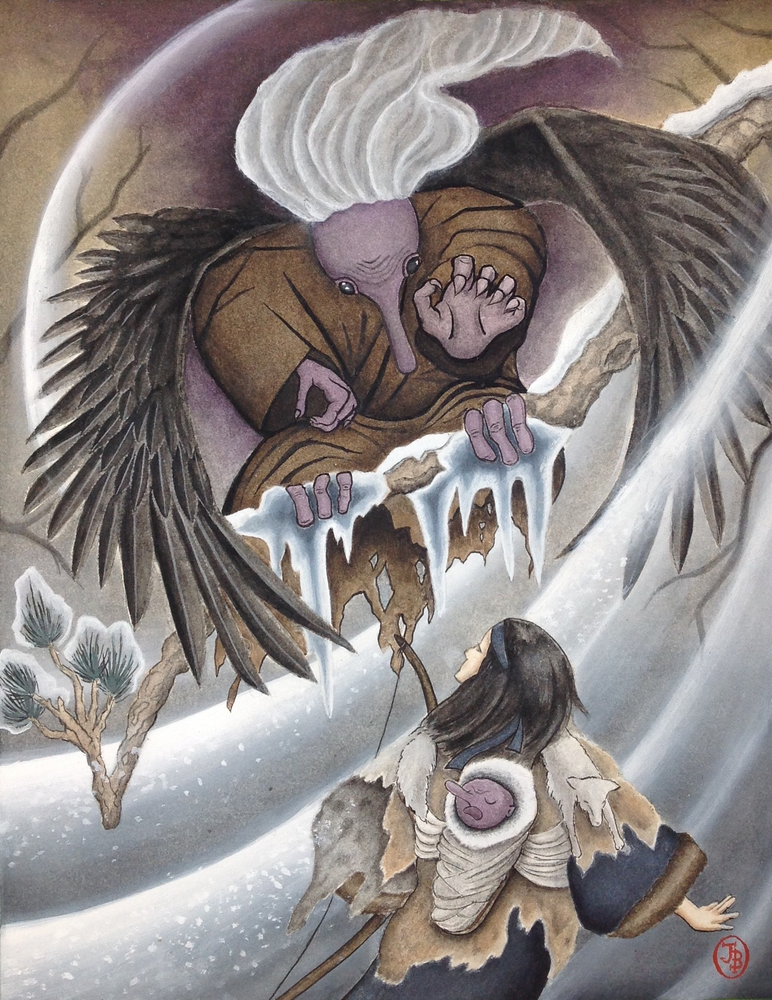

<em>Oknu Territories, Northern Sea Region, 16 BA</em>

When the ancient owl, Old Shaktouk, had first emerged from the heavy snowfall to perch upon the bear cub’s head, Fusa had been sure it meant something; now, after following the leashed cub aimlessly for an hour through knee-deep snow, she was no longer so certain.

The dream sent to her by Old Shaktouk – guardian _kamuy_ of her village – had shown her people starving in a frigid, unrelenting cold. Though Fusa had only seen twelve winters, she knew this one clung too long and that spring's warmth should have arrived weeks ago. And, just as surely as her dead mother would have known, the vision's unspoken message was that her brother's survival was the key to saving her village.

As if in response to Fusa’s thoughts, Goat Urine stirred on her back. She should feed him, she realized, sheathing her arrow in a hip quiver, then leaning her bow against a tree. She stopped Lord Usuk’s aimless meandering with a less-than-gentle tug on his leash, and untied it from her waist, retying it to the base of a young fir tree. Collapsing on a nearby log, Fusa set about untying the ropes that secured her baby brother to her back. She had been so afraid someone would take ptGoat Urine away that she had tied the knots tightly in her haste, and they took a few moments to loosen. Once untied, she lifted him out of the makeshift harness and over her head until he faced her.

Goat Urine's face was the same deep shade of purple as when she had smuggled him out from the Hut of the Cursed, his nose just as bulbous. Goat Urine's skin, bare to the winter chill, was hot in Fusa’s hands. Though it warmed her, she worried it might be a fever brought on by the curse that had befallen him. Whatever changes Goat Urine suffered from this curse, though, he was still her precious brother and Fusa would not leave him to die. Her mother had died during labor while birthing her, and two winters ago her older sister had been taken in a night raid. Fusa had sworn to herself then that she would never again allow her family to be stolen from her.

"Why do you not cry, little brother?" Fusa wondered as she stared into her brother's glistening eyes – orbs of the darkest black she had ever seen - and smoothed his thin hair, white as the snow, in an attempt to comfort him. She took a pouch of soured goat milk from her side and proceeded to feed him. He watched her, quietly drinking from the pouch. Fusa's own stomach growled, but she ignored it. She had only had time to take a bit of smoked deer meat, a few potatoes, and three skins of milk before escaping their village. If their search took much longer, she would need to hunt for more food.

Once Goat Urine had finished his meal, Fusa secured him to her back again and untethered Lord Usuk to her waist. She gathered her bow and quiver and tugged twice on the hemp rope to signal for the bear to lead her somewhere. She shivered as a cold wind blew from the north, chilling her through the three layers of furs and animal hides she wore.

Giving the cub a dubious glance, Fusa wondered again if she had made a huge mistake taking Lord Usuk from her tribe. Wars had been started for less. They would surely pursue her to regain him. She would be lucky if she were only strapped and left out in the snow to freeze overnight. Shivering at the thought, she implored to the cub to show her the way.

"Lord Usuk, please! Show me what I must do to help Goat Urine!"

For his part, Lord Usuk simply stared at her for a moment, issued a squeaky grunt, then walked up to her and nuzzled at the pouch tied to her belt containing dried deer meat. He looked up at her and, if it were possible, she thought he must be smiling expectantly. Nodding, Fusa removed some meat from the bag and laid it on her outstretched palm. The meat disappeared quickly into the bear's hungry mouth. After a moment, Lord Usuk turned eastward, his feet crunching softly in the snow as he walked. Much like before, the cub sniffed around in the snow.

Suddenly, Lord Usuk dove into a snow mound nose-first, arms and legs burrowing as he wiggled deeper, his short tail moving around on his rear end. After a moment, he appeared to seize onto something with his mouth, body flailing back and forth as he attempted to free it. She heard something crack and Lord Usuk's back legs flailed again, unsuccessfully trying to free himself from the hole in the snow. Fusa tossed down her bow and seized Lord Usuk's rear legs, pulling him out of the snow and falling backward onto her rear. Goat Urine squirmed on her back.

"What are you doing?" Fusa asked, a hint of anger tinged her voice as she stood and brushed off her skirts, emphasizing on each word. The bear cub stood and shook his head before turning back toward Fusa, dropping a brown chunk of iceroot on the snow in front of her. He looked up and gave her the same almost-smile he had given before, a long tongue hanging out the side of his mouth.

She grimaced as she reached down and picked up the chunk of iceroot, examining it. Cold to the touch, iceroot snapped off like ice whenever force was applied to it and the broken pieces usually grew back within a day or two. An infestation of the stuff had taken her entire village weeks of effort working together to remove. It had wound its way along the banks of one of the two rivers meeting at her village and had begun to climb huts on the outskirts.

"What are we supposed to do with this?" Lord Usuk simply stared at her and grunted, an expectant look in his eyes, then turned and started walking off again. Scrambling, Fusa stuffed the iceroot into her belt pouch and barely had time to pick up her bow before Lord Usuk’s leash pulled her after him.

The day continued in much the same manner, Lord Usuk leading Fusa around the snowy forest by his leash, clearly searching for something. Half an hour later, he bounded forward toward a cluster of white birch trees and pulled Fusa along awkwardly with his leash as she tried to keep up in knee-deep snow. The cub sniffed about the base of the birch tree until he found a loose piece of bark and tore it off. He turned back to Fusa and dropped the big chunk of birch bark in front of her. She pocketed it and, twenty minutes later, Lord Usuk led her to a bush where he tore off a branch covered with hard leaves that had somehow clung on despite the long winter. He shook the torn branch furiously in front of her, the leaves falling off and scattering in the cold wind, then marched off and tossed the lone branch into the snow. Kneeling, Fusa collected the fallen leaves and stuffed them in her pouch alongside the birch bark and iceroot. Lord Usuk jumped in excitement only he seemed to understand and ran off again, leading her onward.

In a short while, breathing hard, the small group reached a clearing in the snow beneath a sharp overhang that jutted out from a large hill, providing cover from the snow. As they approached the dirt ground beneath the overhang, Lord Usuk picked up a few sticks in his mouth and dropped them on the dirt looking up at Fusa expectantly.

"What now, Lord Usuk?" She inquired, but Lord Usuk continued on, leading her back out into the snow, picking up some sticks and dropping them on the pile, once again looking at her expectantly. "Do you want to build a fire?" Lord Usuk looked up at her and jumped up and down excitedly, giving her a bear’s toothy grin.

Together, they collected six or seven more sticks for kindling, preferring dry ones where possible, and then Fusa tied Lord Usuk to a large root growing from the jutting overhang above them and set about lighting the fire. It took considerable effort, some of the sticks being slightly wet from the snow, but finally a spark caught on the drier kindling and the fire spread. Lord Usuk collected a few more sticks and dropped them in a pile next to the fire.

"You certainly know a lot about building fires, Lord Usuk," she said, casting an uneasy glance at the cub. How could this help Goat Urine? Had she made a terrible mistake taking Lord Usuk from her village? The _kamuy_ trapped in a bear’s body simply grunted and walked over to her, nuzzling at her pouch containing the iceroot, white birch bark, and creepgrass leaves and gave her an expectant look. Something in those eyes reassured Fusa. He was more than a baby bear. Lord Usuk motioned with his nose toward the fire.

"Do you want me to burn this all," she asked him, patting her pouch. Lord Usuk shook his small, hairy head grunting again, more of a squeak than a grunt this time. Fusa's brow furrowed and she collapsed on the ground by the fire, unsure what the cub wanted her to do. She told him as much.

Grunting again, Lord Usuk sniffed around her legs until he found her deerskin pack, biting her leg gently.

"Ouch!" Though it hadn’t really hurt, she rubbed her leg nonetheless. Hastily, Fusa opened the pack and showed Lord Usuk the contents. "You want something?" The cub rifled around the contents of the pack with his muzzle until he seemed to find what he was searching for, pulling out a small, cloth-covered metal bowl. It was precious, that much metal, and one of the few such bowls in her village. Her father had given it to her, trading a number of fox pelts with the Echizoan merchants who sometimes visited. She hastily grabbed the bowl–thankfully wrapped in cloth–from between Lord Usuk's teeth.

"Don't bite that!" She exclaimed, but the bear simply looked up at her and back at the fire. Shaking her head, Fusa unwrapped the bowl and stared at it, then back at her pouch containing plant materials, then at the fire. Suddenly, she thought she might know what the _kamuy_ wanted her to do.

"Do you want me to cook this all on the fire?" In response, Lord Usuk grunted again and seemed to nod. She barely stopped herself from scratching that head staring up at her with its toothy bear-grin.

Sighing, she spread the cloth out in front of her on the dirt and set the bowl carefully on her lap. She then proceeded to take out the creepgrass leaves, iceroot, and birch bark from her pack and place them onto the cloth. Without pausing, she withdrew a small, stone mortar and pestle from her pack and proceeded to crush the ingredients with it, starting with the iceroot. The stone mortar had ridges carefully carved into it which simplified the task of pulverizing the ingredients.

The iceroot crushed readily, its dark brown surface crumbling into a fine powder that she carefully emptied into the bowl on her lap. The birch bark was tougher, and she needed to shave off strips of it with her hunting knife before applying the pestle, grinding up the bark fibers into a loose bundle before also placing it in the bowl. As she proceeded to crush the creepgrass leaves, she noticed Lord Usuk walk over to a nearby pile of snow and begin chomping on it. Shaking her head, she turned her attention back to crushing the leaves until the cub walked over to her lap and spit melting snow into the bowl. He did that once more while Fusa finished crushing the leaves, then settled onto the ground next to the fire and watched her with drowsy eyes. He seemed to soak in the warmth and Fusa realized for the first time that she had warmed from the flames as well.

She dumped the last of the crushed leaves into the bowl, then carefully placed it on the small fire, watching carefully to ensure she did not spill any of the concoction. As she stared into the flames and watched the bowl heat, its contents slowly darkened, and she stirred it with the tip of an arrow. She chatted to Goat Urine on her back, telling him he would be okay. She told him that his big sister would take care of him and that all their troubles would be over soon. By the time the bowl began to boil, the sun had edged closer to the horizon. There was only a few hours of light left before night would set in.

As she wondered how long to let the mixture boil, Lord Usuk woke from his nap, stood, and grunted at her in what she could only interpret as a signal to stop boiling the mixture. Not wanting to waste any of her drinking water, Fusa doused the flames with snow and donned her hide gloves, carefully removing the bowl from the smoldering coals. She placed it onto a small mound of snow and waited for it to cool.
While she waited, Fusa untied her little brother from her back and prepared to feed the concoction to him. As if realizing her intent, Lord Usuk jumped up, growling as furiously as his baby throat could manage.

"Is this not a cure for Goat Urine?" She asked hopefully, but Lord Usuk shook his head, nipping her knee through her skirts and continuing his growling.

"What do you want me to do then?" The cub placed one of his front paws on the same knee and stared at her with eyes containing an intelligence beyond any baby bear.

“You want me to drink it?” She would do so if it would help her brother, and Lord Usuk nodded before stepping back off her knee. "What will happen?" she asked, knowing that the _kamuy_ could not tell her anything useful.

Fusa picked up the steaming bowl and blew on it to cool its contents. Once they had cooled enough to drink, she took a deep breath and gulped from the bowl.

The potion was terrible, an earthy, sour taste that managed to combine the worst aspects of both to make a flavor so acrid she fought not to spit it out. Forcing it down, she drank as best she could and scowled at Lord Usuk. This had better lead her to helping Goat Urine, that much was certain. Otherwise, Lord Usuk had better prepare himself.

Despite her best efforts, Fusa was only able to drink half of the potion before she had to set it down, her stomach revolting and almost causing her to vomit. Grimacing, she cast another scowl at Lord Usuk, but he simply smiled back at her with his toothy, bear-grin.

"What did you make me drink?" Fusa rose and stumbled over to a nearby mound of snow, shoveling a handful into her mouth to wash away the taste. It hardly helped.

Rising again to her feet, though, the world began to shift around her and she stumbled onto her backside in the snow again. As she looked around their small camp, everything began to swirl with an energy unlike anything she had ever seen. A warmth bloomed across her body, tingling her fingers and toes, and the whirling shapes and colors flew about her in a flurry. Her senses were muted, as though felt through thick fur, yet the world felt more alive than ever. Turning her head, the world seemed to rush until she settled her focus on a small stream further down a slope. The light of the setting sun reflected on the surface of the stream and glittered, appearing to spray across the snow-covered forest.

Fusa stared in wonder at a fir tree, snow glittering on its needles, and momentarily felt as if she merged with it, felt the earthiness of its roots reaching deep beneath the soil where they drank nourishment from a reservoir of water far below the ground. She blinked and two squirrels darted out from a nook in the tree, their motion blurred, yet so slow she could see energy emanating from beneath their feet with each bound. The sounds of the forest seemed to wake up around her, the early chirping crickets who had waited all day for night to come and the quiet babbling of a nearby stream rang in her ears like the tiny bells on Echizoan merchant’s wagons. Looking back at Lord Usuk, she was startled to see light emanating from the cub's eyes and mouth, as if this mortal cub’s body was unable to contain the brilliance that was Lord Usuk.

In awe of her surroundings, Fusa stood again and scanned the camp. Twice she almost lost herself in the strange, new world surrounding her, but she remembered her brother and the need to help him. Her gaze settled on a faint mist flowing down from the crest of a nearby hill and following the stream. The mist–dark and wispy–felt wrong. The same way she knew her brother was the key to her village’s survival, Fusa knew that the mist leading off to the west would lead her to the source of her brother’s curse.

Reeling from her first glimpse into the world of the _kamuy_, Fusa set her jaw. Whoever had hurt Goat Urine was in that direction and she would find them, no matter what it took.

She dumped the rest of the potion into the snow, hastily wrapped the bowl, and secured her brother to her back and Lord Usuk to her waist before gathering her remaining supplies and heading off in the direction of the mist. Fusa wasn’t sure when the potion's effects would end and she wanted to track the mist to its source before then.

The crunching sound of her deerskin boots on the snow seemed to rebound around her, echoing in small spaces she was sure would not normally have heard. Focusing her mind on her task, Fusa continued along the trail, her leg gently brushing the mist once as she walked. As she did so, she felt a chill through the furs wrapping her leg as the mist drained it of warmth. Shivering, Fusa decided to keep her distance from the mist.

The moon rose high in the winter sky as she pursued the mist’s source, thousands of twinkling stars joining the moon which seemed to cast more light than usual. The sun sank well below the horizon, and with it the darkness and cold began to slowly envelope the wintry forest around her. The cold especially became stronger and her breath began to freeze on her lips and nose as she continued. She was sure it was not just the setting sun; the longer she followed the dark mist, the colder and more icy the world became.

Finally, after an hour of running alongside the misty trail, Fusa arrived at a small clearing hidden well off the main path which led to the mouth of a cave. The trail of mist seemed to enter the cave and left again along multiple directions.

“Lord Usuk, is it a _wen-kamuy_?” She didn’t expect the cub to answer, but she felt more certain the longer she watched the cave entrance. This must be the lair of one of those dark spirits who caused ill fortune and disease to people unfortunate enough to stumble upon them. Shuddering, Fusa approached the cave's mouth, nocking an arrow as she did so.

At first glance, she thought the opening of the cave was covered with some kind of snow-covered vines. As she approached, though, Fusa could see the vines that hung down over the cave's mouth were actually long ropes of leather and hemp with small animal bones tied into them. The strands of hanging bones were close enough that they would clatter together and alert the cave inhabitants should anyone pass through them. As she stood there considering how she might sneak inside without making noise, she began to have the feeling she was being watched.

Fusa raised her bow and scanned about the clearing, seeing nothing. Her breath streamed from her lips as she sighed with relief, turning to ice in the air before her. She reminded herself that she must be careful – _wen-kamuy_ were dangerous creatures and often wielded evil magic. Varied in form, the only thing that they had in common in stories was their proclivity for tricks and mischief at best, murder and torture at worst.

She turned back to the hanging animal bones and inspected them. The effects of the potion had begun to weaken, but she could still see the bones in minute detail, as if every facet and chip seemed to glimmer in the moonlight. The quality of the energy that emanated from the bones, however, had the same feeling of the rocks and fallen wood around her, devoid of life’s essence.

As Fusa contemplated that thought, a deep sense of dread began to seep into her and she shivered, as if the cold were entering her bones and stealing their life. Not seeing an easy way to avoid making noise, she took a deep breath and reached up, pushing aside the hanging bones. They clattered together softly, yet she forgot them as a voice boomed from behind.

"Give me the child!"

Whirling about, Fusa nearly dropped an arrow in her haste to nock it. High above, perched on a sturdy limb, a winged creature watched with glittering eyes of solid black. The creature was humanoid and appeared to be female, her skin the dark purple of an eggplant. Large, black-feathered wings sprouted from her back, spread open in a fearsome display of power. A cold gust blew and her snow white hair – thick braids interwoven with shells, gemstones, and iron jewelry – clattered about in the wind like a somber wind-chime. The dark mist Fusa had been tracking seemed to pour out of the being, and where her clawed toes touched the thick branch, ice spread over the bark.

The _den'gu_ – for that is what Fusa knew it to be – scowled at her from atop the limb. She had only ever heard stories of them, warnings whispered in hushed tones. Yet, as she stared at the _den'gu_, a dreadful suspicion entered her mind: Could it be that Goat Urine was not truly human? Could it be that he was a _den'gu_ in its infancy? The thought chilled her more deeply than the winter cold ever could.

In the _den'gu_'s left palm, a dark, blue flame sparked into existence, its cold, blue fire casting light about the clearing. In the shadows, the _den'gu_'s glower deepened. Fusa’s body started to move of its own accord, trying to hide behind Lord Usuk, before she stopped herself. Her people had a saying: _Kamuy_ don’t fight our battles; they only show the way.

"Give me the child," the den’gu repeated, her words icy this time.

Bow still aimed at the den’gu, Fusa shook her head firmly. "He is my brother. You cannot have him!"

Sharp teeth peeked out from the _den'gu_'s sneering lips. "Who are you to claim him as brother?"

Fusa tried to stand taller as she spoke. "I am Fusa of the Rakshir tribe of the Oknu, first daughter of Chinita and Sahkalnouk." She wanted to flee from the _den'gu_, yet she gave the creature a defiant look. "Goat Urine came from inside my mother, Chinita, so he is my brother." In truth, Chinita was her step-mother, but Fusa did not want to give the _den'gu_ any more advantage.

The _den'gu_'s face hardened, ice now instead of stone.

“Do not call him ‘Goat Urine’!” She hissed as the name left her lips, black eyes full of icy rage. Beating her feathery wings, she rose into the air and settled onto the ground before Fusa who stepped back cautiously. The dark flame on the _den'gu_’s palm stretched out until it formed a sort of thin shield between them. Through the strange flames – which emitted cold instead of heat – Fusa could still see the _den'gu_ clearly. Despite the wall of flame between them, she readied her arrow to release at the first sign of attack. Goat Urine stirred a moment on Fusa’s back before quieting.

“That is what he is called until he reaches his Naming Day. The name protects him from evil spirits.” As she spoke, Fusa kept her eyes locked on the creature, her arrow a breath away from release. She hoped her face did not betray her lack of confidence. “He belongs to my family and you cannot have him.”

Surprisingly, the _den'gu_’s face softened. The _den'gu_ motioned with her hand and the shield of blue flame disappeared. The lingering effects of Lord Usuk's potion still strong in her senses, Fusa saw traces of what dispersed the flames, thin streams of energy that released the _den'gu_’s hold on the magic.

Urshok regarded Fusa with a wry look. “I see that you are not easily cowed, Fusa of the Rakshir tribe. Perhaps you are this boy’s sister. I am Urshok. Come inside and we shall speak more." The _den'gu_ motioned toward the cave mouth and began to move toward it.

“You won’t hurt G…my brother…will you?” She almost called him Goat Urine again, but was wary of angering the _den'gu_ further.

“Of course not. He is my son.” The _den'gu_ turned back to her briefly, an expression of irritation on her face at having to explain herself. Fusa decided that arguing at this point would only delay any chance of saving Goat Urine.

The _den'gu_ turned back to the cave entrance and pushed aside the strings of bones that guarded it. They clattered together, the only sound other than the crunch of their footsteps on the snow. Urshok’s wings folded onto her back like a giant bird. Fusa followed the _den'gu_, pushing aside the hanging bones and entering the darkness of the cave. Lord Usuk trotted after her.

Up ahead, Fusa saw Urshok gesture with her taloned fingers. The _den'gu_ seemed to embody the terrifying tales of the _wen-kamuy_, the ill-fated spirits she had heard whispered of in her tribe. Blue flames lit along the walls, casting their eerie light through the eye sockets of animal skulls. The tunnel was deep and Fusa squinted to see past the _den'gu_ to what lay ahead. She could make out the passage widening into a larger room.

Upon exiting the tunnel, they entered the inner chamber of the _den'gu_’s lair. It was larger than Fusa expected, with wooden shelves lining the wall on the left that were filled with clay jars, bowls, and wax candles. Fusa was glad to see normal, orange flames burning in a hearth, the warmth partially dispelling the chill that surrounded the _den'gu_. In a corner of the room stood a luxurious bed, its broad surface covered in animal furs, including a giant bear hide. Across the cave was a large, stone counter with sharp knives, a cleaver, and what appeared to be a severed, human leg.

Upon seeing the leg, Fusa immediately turned back to the tunnel, fleeing. Before she could reach the exit, however, a wall of blue flames sprung up to block it, their cold chill entering her bones as she neared. Turning slowly, Fusa faced the _den'gu_ again, trapped.

“Why do you leave, Fusa of the Rakshir tribe? You only just arrived.”

Fusa stared back at Urshok, whose thin lips had curved back, exposing a sharp-toothed smile. “You eat humans,” Fusa replied, drawing her belt knife. The bow would be useless in such close quarters.

“Only when I find them frozen in the snow. Why would I leave them there when the snow preserves them so well?” Sharp teeth glittered from between Urshok’s lips and her black eyes flitted from Fusa’s face to her knife and back again. “Does it offend you that I do not waste their flesh?”

“Will you eat us? We are not frozen and dead.”

“I do not see why it should come to that. We _den'gu_ do not eat our own and you do not look to have much meat on you anyway. I much prefer to eat reindeer than humans.” Urshok smiled again, her sharp teeth glinting in the fire, and motioned to a pile of furs next to the hearth. “Sit, and we shall discuss my son.”

Fusa tugged on the rope tied about her waist, and Lord Usuk followed her to the pile of furs where they both settled themselves. She watched the _den'gu_ cautiously.

Urshok took a pouch from her belt and walked over a stone counter, emptying its contents there. Three large, frozen salmon bounced out of the pouch. When Urshok touched them each with a clawed hand, they thawed instantly, steam rising from them. From somewhere behind the counter, she produced a serrated knife of white bone and deftly began to remove the scales from the fish, lining them up neatly on a long wooden pole. The large skewer she placed over the fire and, as she removed her hand, Fusa could see a web-like net of energy settle over the end of the pole, linking it to Urshok’s hand. The den’gu settled herself across the fire from Fusa and watched her, the skewered fish beginning to turn slowly over the fire with her magic.

“So, Fusa, Daughter of Sahkalnouk. Why is it that you traveled all the way from your village to my home? Your father refused to give me my son, so perhaps you stole him and brought him to me?”

Fusa thought a moment before answering. “No. Go…my brother…is cursed, and Lord Usuk guided me here. I seek to find a cure for my brother.”

“What makes you think he is cursed?” Urshok sneered. ”He looks well to me. Is it because he is a _den'gu_ child and not a human child?” Her eyes narrowed, indicating to Fusa what she thought about that notion.

“My brother cannot be a _den'gu_! I was there when he was born from inside my mother. He is a human!”

“He is a _den'gu_ precisely because your mother gave birth to him and he looks like he does. It is how we _den'gu_ are made.” Urshok laughed and shook her head, clearly not surprised at Fusa’s ignorance. “Wait a moment, child. I will show you.”

Urshok stood again and moved to the shelf containing many dried herbs and took two, tossing them on the counter. She chopped them finely before putting them into an iron kettle into which she ladled water from a nearby barrel. Taking two stone bowls from beneath the table, she picked up the kettle and sat down again across the fire from Fusa. She placed one hand around the kettle, and it began to heat up. The other hand she used to continue turning the skewered fish cooking on the fire. After a moment of uncomfortable silence during which Fusa and the Urshok studied each other, the kettle began to boil and the den’gu poured a transparent, green liquid into each bowl, handing one to Fusa.

“Drink this.”

“What will happen?”

“It will link our minds together for a brief time, and I will show you how it is that your brother came to be my son.”

Unsure what other options she had, Fusa raised the bowl to her lips and drank. Black eyes watching her, Urshok did the same. Fusa felt her forehead and cheeks begin to tingle as the world faded to black. Then, slowly at first, images manifested in the darkness.

Fusa found herself outside the cave, gazing upon a hazy mirage of her father, Sahkalnouk, standing before Urshok. While the words they spoke were silent to her ears, the scene played out clearly in her mind.

Urshok extended a small vial towards Sahkalnouk and he hesitantly reached out his hand. Taking the vial, Sahkalnouk nodded solemnly before downing the potion in one swift motion. Urshok grinned, her teeth glinting in the moonlight. The scene shifted and Fusa saw her father lying with Chinita. She quickly turned away, but the truth had been shown.

Emerging from the darkness, Fusa found herself back in the cave, Urshok watching her. She remained silent, her mind swirling with the revelations she had seen.

"Your father was desperate for a male heir and he made a pact with me for a son," Urshok said. As she continued, her voice began to chill the cave as much as the winds outside. "He was not honest in fulfilling his end of the bargain, however. I have waited, but my patience has waned. He agreed to grant me one request and my child is that request."

Fusa glared at Urshok, anger filling her. “You tricked my father!”

“He should have known with whom he dealt,” Urshok boomed. “We den’gu do not grant favors easily, and a bargain must be honored!” Her voice softened and she reached her hands toward Fusa, toward Goat Urine. “You know this child belongs with me. Your people would not accept him.”

The truth of these realizations and the weight of what she had to do lay heavy on Fusa’s heart. She pulled Goat Urine closer, his innocent eyes looking up at her in confusion. Looking toward Urshok, she met the den’gu’s eyes sternly.

"Twice a month," Fusa said firmly, clutching her brother close. "I will visit him twice a month."

Urshok studied her for a moment before nodding. "Agreed."

Fusa hesitated a moment, adding, “And don't feed him any humans!”

“Also agreed.”

Bending down, she whispered into Goat Urine’s ear. "I'll see you soon, little brother. I promise."

With a heavy sigh, she handed her brother to Urshok, who took him with surprisingly gentle hands. The _den'gu_ looked down at the infant in her arms with an unreadable expression.

An odd feeling filled Fusa as she left the cave, bittersweet tears blurring her eyes. She had completed her mission and saved her village from the curse of perpetual winter. But the cost had been high. As she trudged back towards her village, Lord Usuk padding quietly beside her, Fusa's heart ached for the loss of her brother.

A warm, southerly breeze whipped her hair about, dispelling for a moment the winter’s cold, and Fusa looked back one last time at the mouth of the cave. "Until we meet again," she whispered. She turned about and vanished into the night, leaving a part of herself behind in Urshok's cave.

Lord Usuk glanced up at Fusa, dark eyes gleaming in the moonlight as she led him off. An odd knowing shone in the bear’s eyes. She would face the future – whatever it held – with the help of her little brother. Fusa’s tale had only just begun.
