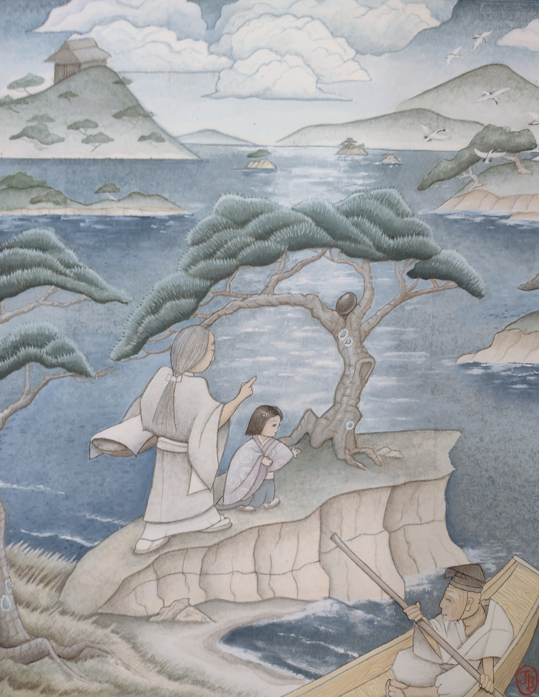

<em>Maki Province, Imperial Region, 15 BA</em>

Oichi watched over her young ward like a hawk. Garbed in a regal _kimono_, the two-year-old princess peered over the side of the boat into the clear water of Tōhō Bay. She reached out to touch the water as it rushed by, but stopped at the sound of her caretaker’s voice.

“Princess, keep your hands inside the boat,” Oichi cautioned, her tone stern. Surprisingly, it did not elicit the usual frown on the child’s face. Perhaps she was too excited to bother with pouting today. After all, it was Fuyumi’s first time leaving the Imperial Palace in Amano Province. Oichi understood the girl’s exhilaration at finally being allowed to participate in the early summer Treasure Hunt – a game cherished by the children of the Imperial family for hundreds of years.

At the helm of the vessel sat a quiet figure – the boatman, an older man descended from ten generations of unwavering service to the Imperial House. His weathered hands guided the boat effortlessly. Trained since birth, he seemed to meld into the vessel such that Oichi was unsure where he ended and the wood of the boat began.

"Oichi, look! Bird!" Princess Fuyumi pointed excitedly to a majestic flock of cranes, their graceful forms gathered near one of the countless, small islands in Tōhō Bay. The island boasted two exquisitely pruned pine trees, their branches reaching skyward with an elegance befitting Imperial presence. Knowing that Imperial representatives often sailed here, the steward of Maki Province spared no expense to ensure only the most skillful artisans attended these pines. With a silent nod, Oichi motioned to the boatman, the man steering the vessel toward the island.

"Those are red-crowned cranes, Princess. It is rare to see them in such large flocks during the summer. It is an auspicious sighting." A smile tugged the corners of Oichi's lips as she watched the enraptured princess. Since the girl's birth, Oichi had been Fuyumi's primary caretaker and, although she had devoted herself to caring for many noblewomen in her fifty years, she found she had a soft spot for the daring princess. Even at two years, the young girl had shown a keen intellect, surpassing even the more privileged male children. Oichi often pondered – privately, of course – what kind of ruler Princess Fuyumi might have become had she been born the eldest male heir instead of her brother, Prince Mochimochi.

As their boat neared the island, the flock of cranes took flight, their slender legs dangling behind as droplets of water cascaded in their wake. Princess Fuyumi gasped aloud, her eyes following the fleeing birds. She stood and reached out toward the white forms as they disappeared into the distance. Careful not to disturb the princess, the boatman glided their small vessel across the mirror-like surface of the water.

“We have left Amano and are now in neighboring Maki Province, Princess. Shall we land on the island and see if there is anything special hidden there?” Oichi hinted at the object of the game and was rewarded with a knowing smile that spread across the princess’s face.

“Egg!” The young princess reached toward the pine trees, where she must have believed a lacquered egg lay waiting for her to discover it. Seeing the excitement in Fuyumi's eyes, Oichi felt a twinge of guilt. It would not hurt for the princess to find a couple of eggs, so long as her older brother found more.

At Oichi's gesture, the boatman maneuvered the vessel closer to the island–barely more than fifteen of Fuyumi's steps across–and secured it on a rocky strip of beach. Between the two sprawling pines, Oichi spotted a black, lacquered egg nestled in the crook of a curved branch. She gently lifted the young princess in the air, setting her sandaled feet down onto the ground facing the direction of the egg. She then stepped off the craft and took Fuyumi by the hand.

The boat's fourth occupant, a heretofore silent old man, quietly exited the boat after Oichi, his eyes scanning everywhere but the princess. As the Shintō Order's chief representative to the Imperial Court, the old man bore the responsibility of ensuring her safety. It was well-known that he was one of the most powerful wielders of magic in the land and the equal of twenty warriors. Rumors of a darker nature hinted at foiled assassination attempts and silenced enemies of the Imperial family.

"Princess Fuyumi, watch your step and don't stray too close to the water," Oichi cautioned. "If you're not careful, we'll have to return to the boat. And there will be no eggs."

"No egg?" Fuyumi’s face brimmed with disappointment, a sight that strangely warmed Oichi's heart.

"Observe the trees, Princess. Perhaps there are eggs hidden within their branches." Oichi suggested, knowing well that the egg from earlier had not been intended for the princess. It lay nestled in the nook of a branch, far too high for a two-year-old to reach. But before Oichi could gesture in the general direction of the egg, she could tell by the way that Fuyumi's face brightened that she caught sight of it.

"Oichi! Egg!" The little princess exclaimed, scampering over to the pine and reaching up toward the hidden egg, her hands just falling short of grasping it.

Oichi shifted the reed basket hitched at her hip, which she carried for the eggs, and hoisted Fuyumi by her waist with both hands. "Princess, can you reach the egg now?"

With a delighted expression, Fuyumi grasped the black-lacquered egg from the tree. Its surface shone in the summer sun, lacquered in black and decorated with pink and blue chrysanthemums two hundred years ago by one of the most famous artists. It was a treasure of immeasurable beauty, captivating Fuyumi completely. Setting the princess back on the ground, Oichi opened the straw basket.

"Place the egg in the basket," she instructed, gesturing to Fuyumi who reluctantly surrendered her prize. "Let's see if there are any others on the island."

Oichi had hoped that Fuyumi's mother could have joined them today. Yet, despite numerous visits from priests and doctors, her malaise had not improved. Neither their tinctures nor spells seemed to alleviate her condition. Having fulfilled her obligation of birthing two male heirs, Fuyumi's older and younger brothers, the Empress now spent most days secluded in her inner quarters while the Emperor seemed content to devote his leisure time to his concubines.

Unaware and unconcerned with the politics of the adult world, Fuyumi continued her search for another egg on the island. Rounding the trunk of the second tree, she noticed a glimmer from beneath one of its exposed roots. Another egg lay concealed there, cleverly hidden from all save the most careful observer. A delighted squeal escaped her lips as she grasped the egg, its surface adorned with green and yellow chrysanthemums. Holding it up to Oichi, she beamed a wide smile.

"Oichi! Egg!" This time, the Princess barely glanced at the egg before relinquishing it to Oichi's basket, her focus already returning to the search. Once Princess Fuyumi set her mind on a goal, Oichi knew she wouldn’t relent until she had achieved it. Now it seemed she had focused all her energies on the hunt for lacquered eggs. Suppressing a smile, Oichi decided it wouldn’t hurt to help the young princess find a few more.

"Princess Fuyumi, I don’t believe there are any more eggs. Shall we continue our journey and search another island?" Oichi proposed, looking down at the little princess. The child considered Oichi's words before grasping her hand and eagerly leading the way back towards the boat.

"Oichi, boat!" Fuyumi's energetic declaration resonated through the air, eliciting a smile from Oichi as she allowed herself to be guided by the young, headstrong princess.

Once Oichi and Fuyumi were back in the boat, with the guardian priest settling behind them, the boatman cast off. He navigated the group towards a cluster of islands – three small ones and one large enough to require a gardener's hut. Oichi signaled towards the smallest of the four, prompting the boatman to expertly steer them towards its shore.

Oichi found herself admiring the boatman's skill. Fuyumi seemed to have chosen him at random, leading her and the priest to him without hesitation. Yet, she had picked a highly skilled boatman. It seemed improbable that she had known about his competence, an invaluable asset for a treasure hunt on the water. Then again, Oichi did recall Fuyumi's fascination with the docks, and how she had watched the boatmen sail in and out of the palace.

The muffled sound of their boat sliding onto the island's shore, accompanied by the rhythmic thumping of Fuyumi as she impatiently hopped, stirred Oichi from her thoughts. "Oichi, egg,” the young princess exclaimed, raising her arms and signaling for Oichi to assist her onto the next island to resume the search for lacquered eggs.

Once ashore, Fuyumi immediately scamped over to the nearest tree, examining its roots, then its limbs. Oichi hastened after her, readying the basket at her hip. Soon enough, Fuyumi found a lacquered egg, this one painted with a green pine tree. A beaming smile on her face, the princess deposited her newfound treasure into Oichi's basket without wasting a moment.

After Fuyumi found another egg, they returned to the boat and journeyed to the next island, where the princess discovered two more. Continuing in this manner, Oichi followed the princess and delighted in each radiant smile that graced Fuyumi's face with each discovered egg. Just as they set off towards the largest island, the one with the gardener's hut, a voice arose from behind Oichi.

"Lady Oichi, Princess Fuyumi seems to be amassing quite a collection of eggs. Perhaps we should sail around the bay for a while and enjoy the scenery? We wouldn't want her to become fatigued." The priest's voice carried a note of nonchalance, but Oichi perceived the hidden warning. She mentally chided herself for letting the excitement overtake her. It was time to slow their pace.

Oichi signaled the boatman to head back to the first island, but the princess instantly objected.

"Oichi, no! There!" Fuyumi pointed to the larger island with the hut on it, but Oichi tactfully disregarded her plea.

"Princess, we should revisit that island. Perhaps we overlooked an egg," she suggested, pointing back towards the first island.

"No egg! Oichi said no egg!" Fuyumi's cry echoed in the air. The look on her face – that of incomprehension as to why Oichi would deceive her – pierced Oichi’s heart like a dagger. What could a two-year-old possibly comprehend about adult motivations? Though Oichi may be obstructing her, why did it feel as though she was acutely aware? The princess's expression bore a complexity of emotion no child her age should be capable of – a mélange of frustration, betrayal, and, if Oichi wasn't mistaken, profound disappointment.

Oichi understood that she teetered dangerously close to failing in her role as Fuyumi’s guardian. Nevertheless, she could not bear to see that disheartened expression on Fuyumi’s face. "Boatman, steer us back towards the large island over there," she directed, indicating the original island with the hut. "It appears the princess has more than enough energy to proceed the Hunt." At her words, the boatman smoothly switched his rowing, deftly turning the small craft around in a swift arc. Within moments, they were speeding back to the larger island, Fuyumi positioned at the boat's helm with a cool breeze sweeping her wispy hair from her face. From her vantage point, Oichi could see a jubilant smile returning to the little princess's face.

From her vantage point, Oichi attempted to locate Prince Mochimochi's boat, but it was nowhere in sight. The other boat must have become concealed by one of the myriad islands. High above the bay, the sun shone brightly, white clouds floating idly across the sky. Oichi could not have wished for a more pleasant day for their boating excursion with the princess.

Soon enough, their boat reached the shore of the next island. The princess, ready to be lifted onto the land by Oichi, raised her arms again. Upon disembarking, Princess Fuyumi led Oichi up a gentle incline to the nearest tree. Upon inspection, though, the tree yielded no eggs. Undeterred, Fuyumi moved to the next pine tree and started circling it, looking for any hint of an egg. Unbeknownst to her, nestled in the pine needles of a long branch directly above sat a lacquered egg with a white crane painted on a blue sky. It had been carefully placed out of her reach, intended for her older brother. Deciding it would do no harm for her to find one more egg, Oichi elected to use this opportunity to teach the little girl a lesson.

"Princess Fuyumi," she called out. The girl continued her search of the pine tree trunk, oblivious to Oichi until she repeated her call, her tone stern this time. The girl finally looked up as her caretaker spoke again. "Don't you see what you're looking for?"

The girl shook her head, clenching her fists at her sides. "No egg!"

Oichi walked over to Fuyumi and gestured for the girl to raise her arms. As Fuyumi complied, Oichi carefully lifted her, settling her sandaled feet on a sturdy, low-lying pine branch. From this elevated position, Fuyumi should be able to spot the egg nestled on the nearby branch.

"Sometimes, when we do not see what we're looking for, all we need to do is change our point of view," Oichi explained.

Sure enough, Fuyumi's face lit up as she spotted the egg. "Oichi! Egg!" she exclaimed, pointing with excitement.

Hoisting the princess again, Oichi maneuvered her close to the lacquered egg, allowing Fuyumi to retrieve it from its bed of pine needles. Once she'd safely set the princess back on the ground, Oichi opened her basket, and the newfound egg disappeared inside.

Their search of two more pine trees proved fruitless until, secreted in the hollow of a third tree, Fuyumi discovered another lacquered egg. Adorned with gold leafing and emblazoned with a vibrant sun of orange and yellow, it was a sight to behold. With both hands, Princess Fuyumi delicately retrieved it from its hiding spot and held it up to Oichi in triumph. Suddenly, however, a shout came from the side.

"Okazu! I found a golden one!"

Out of nowhere, Prince Mochimochi rushed towards Fuyumi, his gaze fixated on the golden egg. Oichi's eyes widened as, with unabashed audacity, Mochimochi plucked the egg from his sister's outstretched hands. Raising his stolen treasure with a self-congratulatory air, he turned on his heel and dashed back the way he came, without a single word to his stunned sister.

From behind a large pine, the prince's caretaker, Okazu, and his other attendants emerged. Okazu held a basket and, as the boy approached she opened it, the golden egg disappearing inside. Indignation rose within Oichi like hot bile and words crossed her mind that she would never dare speak. Yet Oichi's anger paled in comparison to the outrage of the princess.

"Give back Fuyumi's egg!" The girl cried, tears already forming in her eyes. She stamped and jumped in a determined tantrum.

Hands folded neatly in front of her, Okazu glided past Oichi without so much as a glance, intercepting the princess with the grace of a swan. "Now Princess," she said in a cloyingly sweet voice. "Prince Mochimochi likes this egg, and he's been searching so hard today. Why not forget about it and search for another egg?"

Unsurprisingly, Fuyumi found the prospect wholly unacceptable. "Fuyumi find! Fuyumi's egg!" She shouted, stretching her small hands toward Okazu's basket, where she knew her stolen egg lay concealed. She had all but disregarded Mochimochi himself, who had already begun marching away, chubby arms pumping as he went. The boy turned back toward them and commanded his caretaker.

"Okazu! Come!" Without waiting for any response, he continued his march back towards the direction from which they had first come.

"Oichi, I expected better from you," Okazu chided, clicking her tongue disapprovingly, deftly moving the basket out of Fuyumi's reach before following after the prince.

Oichi's cheeks bloomed with a mix of anger and embarrassment. Bowing to Okazu in a symbolic gesture of apology, she just managed to maintain her outward composure, refusing to openly disrespect the woman who held seniority among the Imperial attendants. However, beneath Oichi's formal exterior, a storm of indignation roared, incited by Okazu's intentional provocation and fueled by her own emotional response to it.

Turning toward the princess, Oichi walked over to her and knelt before the crying girl. As she watched her young charge, a resolve crystallized within her. The image of the prince stealing Fuyumi’s egg, coupled with Oichi's knowledge of how diligently the princess had searched for it, ignited a fiery defiance dormant within her. In that moment, her only objective became restoring Fuyumi's smile.

Despite her inner turmoil, Oichi spoke to the princess in her usual stern, yet caring voice. "Princess Fuyumi, stop crying. Crying will not change your situation." She procured a cloth from the folds of her kimono and wiped the tears and snot from the girl's face. "Would you not rather fight a battle you can win?" At the sound of Oichi's voice, Fuyumi's tantrum subsided to quiet sniffles and she watched her caretaker with newfound interest.

"Fuyumi find eggs?"

"Yes. If you find all the other eggs, it won't matter that you lost one to the prince." Oichi knew she shouldn't be encouraging the girl, but this was a teaching moment she could not ignore. A part of her was curious to see how Fuyumi would respond if she were encouraged. For the moment, Oichi had abandoned reason, motivated solely by a burning desire to see Fuyumi triumph. At the prospect of finding all the eggs, resolve replaced the tears on the child's face. Eyes shimmering with determination, she reached over and took Oichi's hand.

"Oichi, come." Already, the princess was scampering off to the nearest pine tree. Oichi hurried after her, fueled by the unshakeable desire to help the girl find every egg possible.

In a flurry, they scoured the rest of the large island for eggs, uncovering two the Prince had missed, one in a flower pot beside the hut and one tucked cleverly within the gnarled roots of a fig tree. In no time, they were racing back to the boat, the guard priest struggling to keep pace with a princess utterly consumed with her quest for all the eggs.

Once back to the boat, the boatman sped them from island to island. Oichi eventually found herself panting to keep up with Princess Fuyumi. One after another, lacquered eggs of all the colors of the rainbow vanished into her basket. When an egg Fuyumi found lay just out of her reach, Oichi was there to lift her. As time passed, the straw basket at Oichi's hip began to feel quite full.

The guard priest again subtly cautioned Oichi, mentioning something about the princess potentially becoming exhausted from all the activity, but she dismissed him with a wave. In that moment, Oichi had no care for anyone but Princess Fuyumi and her smile, shining brightly as the sun.

After what felt like an eternity, a firework from the shores of Amano careened across the sky. Its brilliant explosion of colors–barely discernible in the early afternoon–marked the end of the game and signaled the Imperial children to return to the palace gardens.

"Well, Princess, that signal means the game has concluded. It is time to return to the palace and see how many eggs we managed to gather," Oichi gently informed Fuyumi. Carefully, she lifted the lid of the basket, revealing its bounty to the princess. "Look at all the eggs you've found!"

Fuyumi's eyes widened at the sight. "Lots of eggs! Fuyumi's eggs!" She exclaimed with delight.

"That's right, Princess Fuyumi’s eggs!" Oichi allowed a rare smile to spread across her lips, mirroring Fuyumi's joy. Oichi reached out, grasping the young princess's hand tenderly, and led her back towards the boat. The sun hung low in the summer sky, casting a warm glow over the end of their grand adventure.

Once everyone was settled in the boat, the adept boatman set off on the return trip to Amano Province. Off the starboard side, the prince's boat emerged from behind another island, also making its way back to Amano. After about twenty minutes, they arrived at an estuary that diverged into a labyrinth of channels. Having navigated these waterways since childhood, the Imperial boatmen knew each turn required to lead them back to the secluded gardens of the outer Imperial Palace grounds.

Once they entered the waters of the palace gardens, the two boats neared a gentle beach. Standing in the late afternoon sunshine was Emperor Go-Sengo and a large entourage of attendants, guards, and, of course, Ochacha, his favored concubine. Ochacha was resplendent in a beautiful kimono adorned with red, white, and orange flowers and edged with golden fabric. Each of its seven layers was worth more than the collective wealth of Oichi's birth village. Oichi couldn't help but note that, with her gaudy makeup and numerous hairpins, Ochacha looked more akin to a flamboyant courtesan than a high-ranking Imperial concubine. The Emperor, for his part, wore his customary attire – flowing white multi-layered robes and a large, black cylindrical hat. He regarded the approaching ships with a dispassionate expression, his presence there seeming more out of respect for tradition than personal interest. Then again, the Emperor had always been more interested in his incessant plotting than family or tradition.

The boatmen guided their vessels to rest on the beach, and the passengers set about disembarking. Oichi helped Fuyumi out of the boat, setting her sandaled feet onto the ground gently, before stepping out herself. Upon seeing her father, Fuyumi's excitement abated, and she reached up to hold Oichi's hand.

The Emperor held a belief that all women should be silent, except perhaps Ochacha, upon whom he clearly doted. Fuyumi, having been scolded numerous times by her father, instinctively drew the folds of her caretaker's kimono around herself. Oichi's indulgence of the girl hand limits, however.

"Stand properly before your father, Princess Fuyumi, as befits a daughter of the Imperial household," she said softy. She spoke for the princess alone, yet her stern tone was unmistakable.

At Oichi's chiding, Fuyumi–ever the intelligent young girl–stepped out from behind her caretaker and let go of her hand. She regarded her father warily as he descended a wooden bridge through the garden, but fortunately, the Emperor’s attention was elsewhere.

Prince Mochimochi too had disembarked, and his larger entourage moved toward the bridge. The Emperor barely glanced at his daughter before beaming a smile at his eldest son.

"Did you gather many eggs, my son?" The Emperor asked, his tone implying there was only one acceptable response.

"Yes! I found lots!" Mochimochi answered, smiling warily. Mochimochi knew well the price of angering his father, though he was often spared the brunt of it.

"Let us count the eggs, then, and see who is the winner." The Emperor signaled his attendants, who divided into two groups of three, one approaching Okazu and the other approaching Oichi. Each caretaker relinquished their basket and the attendants carried them to opposite sides of the garden. With great care, they gently poured the lacquered eggs from the baskets, their colorful, oblong shapes tumbling out onto the verdant grass in two separate heaps.

Silence hung in the air as the crowd held its collective breath, no one daring to acknowledge what lay before them. The pile from Fuyumi's basket was visibly larger. The princess had bested the prince in the Treasure Hunt – an outcome Oichi had been sternly warned must not happen.

Unaware of the gravity of the situation, Fuyumi scanned the piles of lacquered eggs, her gaze locking on a familiar egg in Mochimochi's pile, the one with gold leafing that the Prince had stolen from her. With a sudden burst of energy, she broke free from Oichi and dashed over to Mochimochi's pile. Triumphantly, she seized the golden egg, holding it aloft with jubilation.

"Fuyumi's egg!"

The prince gasped in protest, but was swiftly silenced by Okazu. "My, my!" Okazu exclaimed. "The baskets must have been accidently switched shortly after arriving. That can be the only explanation." She gestured towards the larger pile, the one that Fuyumi had gathered. "This pile must be the prince's." Clearly not understanding the situation, Mochimochi attempted to protest again, only to be silenced again by Okazu's stern gaze.

Oichi worried that Fuyumi might protest. However, the little girl seemed to have completely lost interest in the other eggs, hurrying back to Oichi with the golden one cupped in both hands. She held her precious treasure as if fearful the thief might return to reclaim it.

Oichi was thankful for Okazu's quick thinking. Yet, as she looked up at the Emperor, she knew he would not be so easily placated. The Emperor angrily motioned to his chancellor, murmuring something before abruptly spinning around and marching back up the bridge, his entourage following closely behind. All except for the chancellor, who, followed by a single servant woman, quietly descended the bridge to approach Oichi.

Realizing she had too few years left to waste on worry, Oichi straightened her back and met the chancellor's approach with calm serenity. Whatever punishment the Emperor had for her, she would not be informed of it here, where the prince and princess might overhear. She would certainly be summoned to a more private location. As the man came to a halt before her, he spoke in a tone stripped of emotion, as cold and formal as the imperial court itselt.

"Lady Oichi, you are summoned to the Outer Quarters immediately. There we will discuss today's happenings." He turned to address the woman next to him. "See the princess safely back to the Inner Quarters and the care of her mother."

Oblivious to her caretaker's predicament, the princess clutched her golden egg tightly, a bright smile on Fuyumi's face. Her gaze lingering on her ward, Oichi nodded absently to the Emperor's advisor, barely noticing him. Despite the looming threat, the day had been a pleasant one, as pleasant as any she had known.

"Of course," Oichi responded. Having interfered with Imperial orders, she was uncertain of the consequences that awaited her. Given her years of faithful service to the Imperial family, it was doubtful she would be executed. However, the alternative–banishment from the palace–somehow felt worse. A quiet voice inside Oichi's head chided her for getting carried away, whispering that Fuyumi would need her. But for the moment, as she glanced back at the young princess – clutching her golden egg and beaming with pride – Oichi could not bring herself to care. She could only hope that whoever replaced her would care well for the girl.

As Oichi was led away by the Imperial chancellor, she stole one final, lingering glance at Fuyumi. The young princess was already being ushered away, blissfully unaware that anything was amiss.

It would be many years–not until the princess came searching for Oichi–that the two met again.
